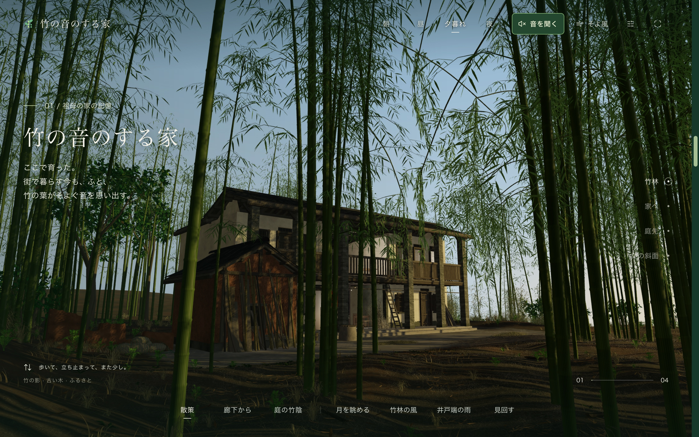
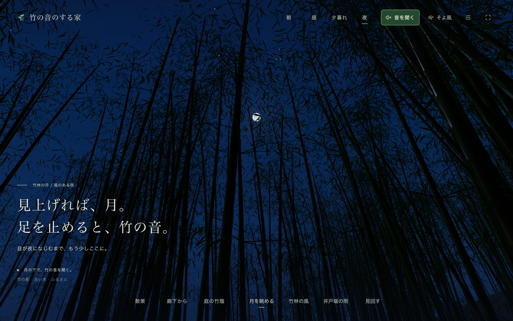

# 竹の音のする家

[English](README.md) · [简体中文](README.zh-CN.md) · **日本語**

竹の海に、ふるさとの面影。戻らぬ日々をそっとたどる、小さな 3D の風景。

**[竹林を訪ねる →](https://yuuki.fans/ja)** · [English experience](https://yuuki.fans/) · [中文体验](https://yuuki.fans/cn)



ここで育ちました。貯水池の向こうにある家へは、小さな木の舟で渡っていました。年月が流れ、数枚の写真を Astra に渡して、AI と一緒に記憶の中の風景をつくり直しました。

今は高いビルのある暮らしに慣れました。もうあの頃には戻れないけれど、あの場所のかけらを、ここに残しておきたいと思います。

竹林を歩き、縁側でひと休みし、月を見上げる。時間帯や天気を変えて、**音を聞く**をオンにすると、風や雨、鳥や虫の声が聞こえます。音は最初はオフです。

<details>
<summary>竹林で、月を眺めるひととき</summary>



</details>

## ローカルで動かす

Node.js ≥ 22.13.0 と pnpm 11.14.0 が必要です。モデルと音声はリポジトリに含まれています。

```sh
pnpm install
pnpm dev
```

`pnpm check` で検証し、`pnpm build && pnpm preview` で本番用ビルドをプレビューできます。Three.js、React、TypeScript、Vinext/Vite を使用しています。

[開発・保守](docs/development.md) · [パフォーマンス計測ツール](tools/scene-perf/README.md) · [デプロイ](docs/deployment.md) — 詳しい技術文書は中国語です。
