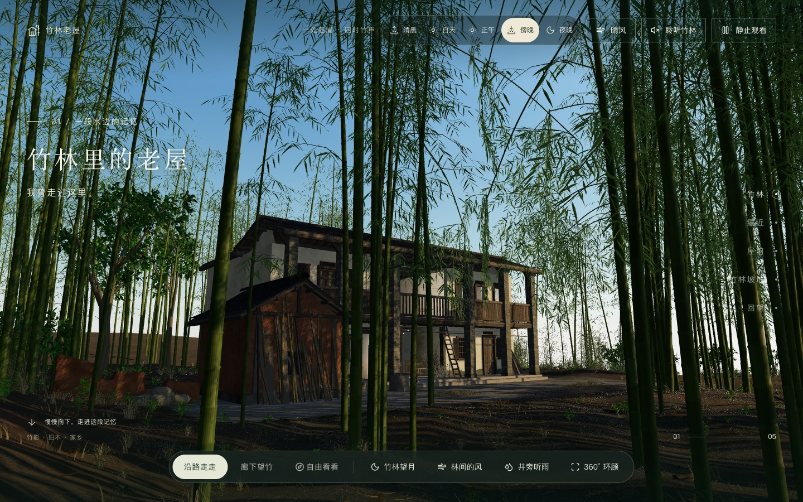
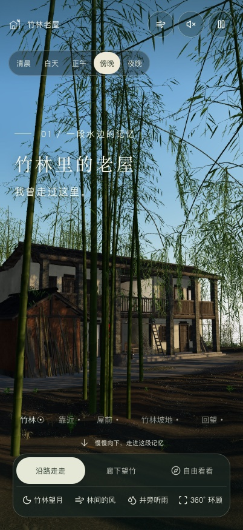
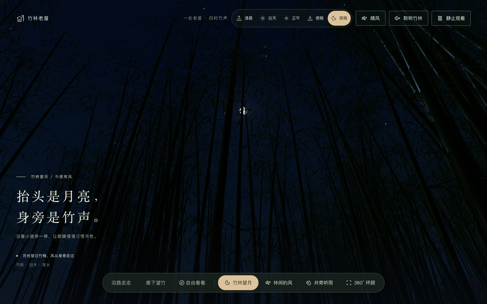
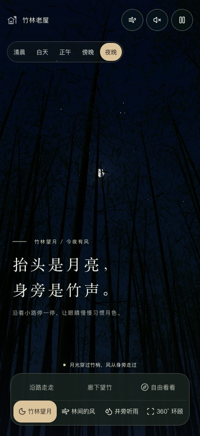

# 竹林里的老屋 · Bamboo Old House

基于 Three.js 的交互式 3D 老屋场景，在竹林、木廊与房间之间漫游，感受晨昏、风雨和自然声景。支持沿路漫游、自由视角、360° 环顾与竹林望月，可切换五个时段和四档天气。

使用 React、TypeScript、Three.js、Tailwind CSS 与 Vinext/Vite，源码位于 [`src/`](src/)。

## 预览

| 桌面端 | 移动端 |
| --- | --- |
| 傍晚老屋<br> | 傍晚老屋<br> |
| 竹林望月<br> | 竹林望月<br> |

桌面端截图为 1440 × 900；移动端为浏览器视口模拟，尺寸为 402 × 874。

## 资源

| 资源 | 位置 | 用途 |
| --- | --- | --- |
| 老屋建筑 | [`architecture.glb`](public/models/architecture.glb) | 老屋主体、室内外建筑结构与陈设 |
| 竹林 | [`bamboo.glb`](public/models/bamboo.glb) | 四组竹竿与竹叶模型 |
| 廊下竹枝 | [`porch-bamboo.glb`](public/models/porch-bamboo.glb) | 木廊附近垂落、随风摆动的竹枝与竹叶 |
| 背景植被 | [`background-foliage.glb`](public/models/background-foliage.glb) | 背景乔木、树冠与灌木 |
| 林下植被 | [`understory.glb`](public/models/understory.glb) | 林下与山坡上的蕨类、草丛 |
| 干柴堆 | [`dry-fuel.glb`](public/models/dry-fuel.glb) | 院落中的干柴堆 |
| 竹子 LOD | [`bamboo-lod.json`](src/components/scene/generated/bamboo-lod.json) | 从竹子模型生成的远景简化数据 |
| 自然录音 | [`public/audio/`](public/audio/) | 九段风、雨、鸟鸣与虫鸣等录音；[来源与致谢](public/audio/credits.md) |
| 备用画面 | [桌面](public/scene-poster.webp)、[手机](public/scene-poster-mobile.webp) | 静态场景画面 |
| 图标 | [`icon.svg`](public/icon.svg)、[`favicon.svg`](public/favicon.svg) | 网站图标 |

GLB 已内嵌贴图与缓冲数据。声音在用户主动操作后播放，并随时段和天气变化。

## 资源更新

资源来自同级建模项目 `../blender-two/`；只有同步资源需要该目录，日常代码开发不依赖它。修改 `.blend` 后需先导出网页资源。

| 更新内容 | 处理方式 |
| --- | --- |
| 模型、贴图或录音 | 导出到 `../blender-two/website/public/` 后执行 `pnpm sync` |
| 竹子模型 | 同步后执行 `node scripts/generate-bamboo-lod.mjs`，将 `bamboo.glb` 与生成的 `bamboo-lod.json` 一起提交 |
| 模型增删改名、地形、布局、相机、灯光或天气效果 | 同时合并原项目 `website/components/scene/` 到本项目 `src/components/scene/` 的对应代码 |
| 页面或交互 | 对照原项目 `website/app/`、`website/components/experience.tsx`，合并到本项目 `src/` 的对应位置 |

`pnpm sync` 通过 `rsync` 单向复制资源并重新构建，替换同名文件、补充新资源，不自动删除额外文件。它只同步资源；代码需单独合并，并保留本项目的依赖、锁文件与构建配置。

## 修改验证

目标为 `main` 的 PR 和 `main` 更新会运行 [CI](.github/workflows/ci.yml)，检查类型、lint、回归测试、竹子 LOD 数据一致性和生产构建，统一显示为 `Checks`。

涉及渲染或交互的修改，还需在手机与桌面预览中确认实际效果，尤其是首次进入、昼夜切换、风雨和视角切换。

## 性能采集

平时用页面内面板找出「哪里卡了」，优化前后用批量流水线比较「有没有改善」。工具只做观测，不改变画质、声音、加载顺序或转场行为。

### 日常使用与开关

在 Chrome Canary 使用生产预览，避免影响日常 Chrome，也避免把开发模式的开销当成产品性能：

```sh
pnpm build
pnpm preview
```

- **打开面板**：[http://127.0.0.1:4175/?perf=1&perfUI=1](http://127.0.0.1:4175/?perf=1&perfUI=1)。
- **普通页面**：[http://127.0.0.1:4175/](http://127.0.0.1:4175/)。可以把两个地址加入书签。
- `?perf=1` 只开启业务阶段记录；同时添加 `&perfUI=1` 才加载实时面板。线上部署包含工具的版本后，也能使用 `https://yuuki.fans/?perf=1&perfUI=1`。

目前没有页面内的一键诊断总开关；**完整退出需移除 `perf`、`perfUI` 参数并重新加载页面**。仅修改地址而不重新加载不会改变本项目的诊断模式。

| 面板操作 | 实际效果 |
| --- | --- |
| 折叠 | 继续采集，标题保留当前频率与流畅状态 |
| 暂停采集 | 冻结运行时读数与时间轴；不停止全部业务阶段与资源记录 |
| 继续采集 | 开始新的连续采样，通常约 5 秒后给出流畅状态 |
| 清空窗口 | 清除实时历史，保留加载时间线；不清浏览器缓存、不卸载模型或音频 |
| 导出 JSON | 保存当前保留的卡顿、运行时、加载阶段和资源数据到本机 |

推荐的日常检查顺序：

1. 从诊断地址重新进入，查看「加载时间线」里的模型、模块、场景构建、着色器准备和 HTTP 缓存证据。
2. 切到「实时运行」，保持页面前台约 5 秒，再做一个明确操作，例如「竹林望月 → 林间的风」、开启声音或切换天气。
3. 查看绿色「合适」、黄色「中等」、红色「卡顿」，并打开「最近卡顿」确认操作后的停顿位置、时长及当时的声音和场景状态。上方 Hz 是浏览器 RAF 回调频率，不是屏幕实际呈现的 FPS；平均频率正常也要留意最大间隔。
4. 复现后及时暂停、导出。图表保留最近 30 秒，卡顿记录最多 120 条；检查另一组操作前可以清空窗口。
5. 分别观察首次和重复操作。首次开声的下载、解码与再次开声的资源复用是不同条件，清空窗口不会恢复首次加载状态。

### 优化前后批量对比

`pnpm perf` 使用 sitespeed.io / Browsertime 操作真实控件，产出独立 HTML、Markdown、JSON 和可选浏览器 trace。先按[采集工具说明](scripts/perf/README.md#开始使用)配置 Canary 与匹配的 ChromeDriver，然后选择专项：

| `--flow` | 覆盖范围 |
| --- | --- |
| `load` | 从导航开始的首屏加载 |
| `views` | PC 望月与听风的首次、重复双向切换，保留自动开声行为 |
| `system` | 声音、音量、天气、昼夜及主要系统按钮 |
| `journey` | 首屏、自由视角、首次进屋、返回、再次进屋 |
| `cache` | 同会话首访与复访，记录本地缓存、协商验证及网络传输证据 |

```sh
# 优化前，保存三轮场景切换基线
pnpm perf --flow views --profile desktop --mode baseline \
  --iterations 3 --out outputs/performance/views-before

# 优化并重新构建后，用相同条件采集、对比
pnpm perf --flow views --profile desktop --mode baseline \
  --iterations 3 --out outputs/performance/views-after \
  --compare outputs/performance/views-before
```

打开新目录内的 `report.html`。输出目录必须尚不存在，后续复测使用新的名字。固定设备、浏览器、画质、声音、天气和采集配置；正式比较使用不显示实时面板的默认配置。需要调用栈时使用 `--mode diagnostic --iterations 1` 单独定位，不与 baseline 混算收益。工具会检查条件，缺失或不一致时拒绝输出可比的收益百分比。

### 用于其他 3D 项目或拆卸

通用工具位于 [`tools/scene-perf/`](tools/scene-perf/README.md)，可整体复制到其他项目，无须复制竹屋场景、模型或页面组件：

| 层 | 接入方式 | 依赖与用途 |
| --- | --- | --- |
| 浏览器核心 | `createRuntimeCollector(adapter)`、`createPhaseRecorder(options)` | 不依赖 React 或 Three.js；RAF、长任务、业务阶段和明确的 `dispose()` |
| 页面面板 | `usePerformancePanel(adapter, { enabled })` | React hook；按需加载面板，关闭或卸载时清理采集资源；面板使用 Base UI Progress |
| 批量流水线 | CLI `--adapter`、`--scenario` | Node、Canary、ChromeDriver；适配就绪条件、状态和真实控件操作 |

本项目差异集中在 [`src/performance/bamboo-adapter.ts`](src/performance/bamboo-adapter.ts)、[`src/lib/performance.ts`](src/lib/performance.ts) 和 [`scripts/perf/`](scripts/perf/README.md) 的项目适配器／操作流程。通用核心不读取竹屋 DOM 或 `__BAMBOO__`，也不接管项目的渲染循环。

可以复用到 Three.js、React Three Fiber 及其他浏览器 3D 项目；渲染器指标由项目显式提供。Blender 导出的 GLB/glTF 在网页中的加载和渲染适用，Blender 桌面软件内的建模、烘焙、离线渲染不在覆盖范围内。WebGPU 项目可复用浏览器指标，但不能把 WebGL 的读取方法直接套用到 WebGPU。

**可拆卸分为两层**：卸载面板／关闭 hook 会释放 RAF、观察器、监听器和定时器；若要彻底移除源码，还需移除集中入口与业务计时调用，再删除工具目录。保留埋点但令 recorder 禁用时，业务函数仍照常执行。完整的复制、最小接入、清理边界与限制见[独立工具 README](tools/scene-perf/README.md)。

从 [建立基线与一键复测](docs/performance/pipeline.md) 开始；运行条件和 Chrome Canary 配置见 [采集工具说明](scripts/perf/README.md)。换 Three.js / Blender 项目时参照 [适配器契约](docs/performance/adapter.md)。另有 [实时运行与加载时间线](docs/performance/diagnostic-view.md)、[HTTP 缓存与首访／复访](docs/performance/http-cache.md)、[整体页面流程图](docs/performance/page-lifecycle.md)、[首次实测与瓶颈证据](docs/performance/first-capture.md) 和 [3D 专项开源工具对比](docs/performance/open-source-tools.md)。

## 预览与正式发布

使用现有 Cloudflare Workers Builds：功能分支和 `main` 都只上传预览版本，验收后由维护者手动将同一版本发布到正式站。首次使用需要先调整控制台，仓库配置本身不会关闭现有自动上线。

完整设置、首次切换顺序、版本核对和回退步骤见 [部署说明](docs/deployment.md)。四项后续工作见 [本地 issue](docs/issues/README.md)。
