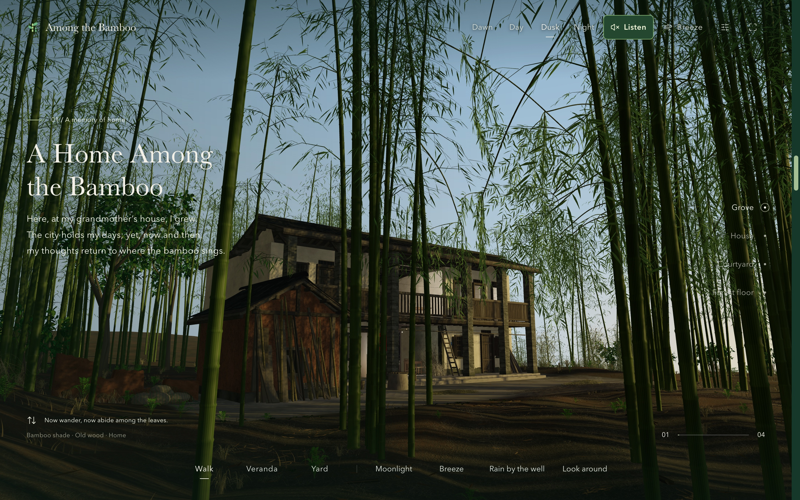
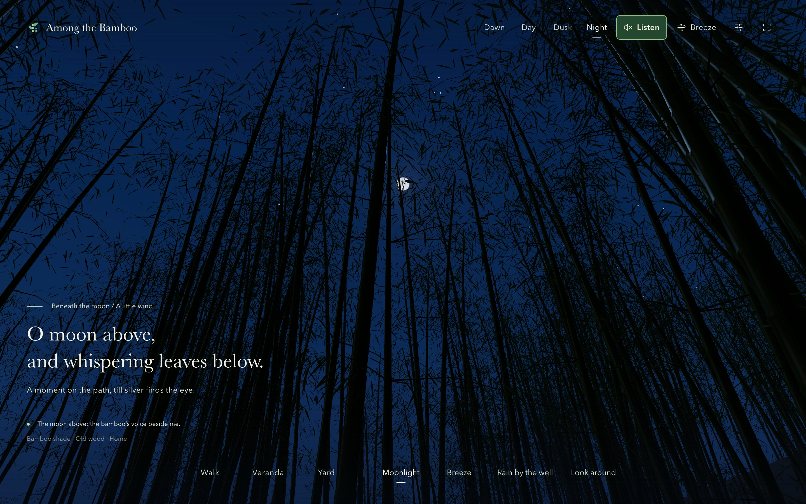

# A Home Among the Bamboo

**English** · [简体中文](README.zh-CN.md) · [日本語](README.ja.md)

My home lies where the bamboo meets the sky; what time has taken, memory shall keep. A childhood remembered in 3D.

**[Step into the grove →](https://yuuki.fans/)** · [中文体验](https://yuuki.fans/cn) · [日本語で見る](https://yuuki.fans/ja)



I grew up here. To get home, we crossed a reservoir in a wooden boat. Years later, I gave Astra a few photos and rebuilt this memory with AI. I live among tall buildings now. I cannot go back, but I can keep a little of that place here.

Walk through the grove, rest on the veranda, or look up at the moon. Change the light and weather; turn on **Listen** for wind, rain, birds and insects. Sound starts off.

<details>
<summary>A moment under the moon</summary>



</details>

## Run locally

Node.js ≥ 22.13.0 and pnpm 11.14.0. Models and audio are included.

```sh
pnpm install
pnpm dev
```

`pnpm check` runs validation; `pnpm build && pnpm preview` serves the production build. Built with Three.js, React, TypeScript and Vinext/Vite.

[Development](docs/development.md) · [Performance](docs/performance/pipeline.md) · [Deployment](docs/deployment.md) — detailed guides are in Chinese.
