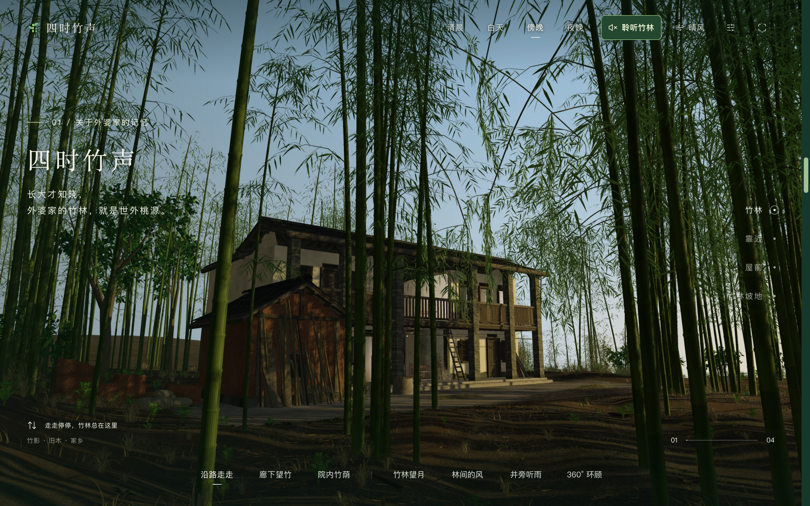
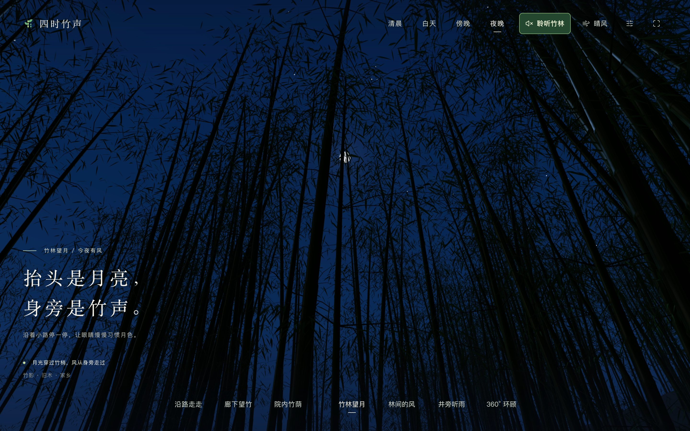

# 四时竹声

[English](README.md) · **简体中文** · [日本語](README.ja.md)

竹海里的故乡，风还认得旧时的屋檐。一段可以走进去的 3D 记忆。

**[走进竹林 →](https://yuuki.fans/cn)** · [English experience](https://yuuki.fans/) · [日本語で見る](https://yuuki.fans/ja)



这是我小时候长大的地方。隔着一片水库，要坐木船才能到。多年后，我给了 Astra 几张照片，借助 AI，把记忆中的故乡重新搭了起来。

我长大了，也习惯了高楼大厦。虽然已经回不去，但总想为那片竹林，留下一点什么。

沿路漫游，在木廊歇一会儿，或抬头望月。可以切换晨昏与风雨，点亮 **聆听竹林**，听风、雨、鸟鸣与虫声。声音默认关闭。

<details>
<summary>也在竹林里，看一会儿月亮</summary>



</details>

## 本地运行

需要 Node.js ≥ 22.13.0 和 pnpm 11.14.0。模型与音频已包含在仓库中。

```sh
pnpm install
pnpm dev
```

`pnpm check` 运行项目检查；`pnpm build && pnpm preview` 构建并预览生产版本。使用 Three.js、React、TypeScript 与 Vinext/Vite。

[开发与维护](docs/development.md) · [性能工具](tools/scene-perf/README.md) · [部署说明](docs/deployment.md)
