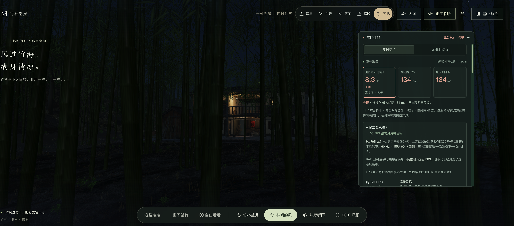

# 第三阶段：全场景共用渲染路径

## 范围与约束

- 分支：`perf/tidewater-scene-optimizations-03-global-rendering`。
- 直接父提交：`b0cb10b5411359b6a93717e383a690e520bc74dd`，第二阶段已记录并提交用户实看反馈。
- 用户明确要求优化整个体验：步行、廊下、自由探索的室内外地点、望月、林间风、井旁听雨与 360° 环顾，覆盖五个时段及全部天气；不能只优化雨景。
- **默认保留原有完整呈现效果。任何分辨率、阴影时序或其他视觉取舍，都由用户明确选择，禁止按性能读数自动降档。**

## 新的用户证据

2026-09-26 用户补充截图：夜晚、大风、林间的风，性能面板显示近 5 秒 RAF 平均 **8.3 Hz**、帧间隔 p95 **134 ms**、最大 **134 ms**；41 个前台样本、完整间隔合计 4.92 s、慢间隔 41 次，首屏控件就绪 4.97 s。面板仍标为“卡顿”。

这是跨场景问题的用户证据，不是受控基线，不能与第二阶段另一视角的 26.7 Hz 直接相除。RAF 回调频率也不等于实际画面 FPS。具体设备、DPR、浏览器和 GPU 帧时尚未采集。



## 源码发现与待验证假设

1. 同一主渲染循环覆盖所有视角；室内经过 contact/composer，室外直接 renderer。优化及配置必须同时作用于两条路径。
2. 方向光阴影默认每次主场景渲染都刷新，即使暂停后风动时间、风强度、光源变换等输入都没有改变。仅在阴影输入完全一致时复用，可避免重复计算而不改变时序。
3. Three r185 点光源代码已跳过零贡献光源的阴影采样，但仍调用直接光 BRDF。只对内置标准/物理材质的零贡献点光源跳过该调用，保留非零贡献、其它灯光与原有材质补丁。
4. 用户可选减少渲染像素或隔帧更新动态方向光阴影，这些有视觉代价，默认关闭，不能算作默认无损优化的收益。

## 验证计划

- 不使用 computer-use；通过源码、确定性测试、项目检查及构建验证。
- 验证阴影首次绘制、暂停/恢复、风雨渐变、时段渐变、视角切换、尺寸变化和配置切回；仍有输入变化时默认每帧更新。
- 保留作者 DPR 上限、几何、材质、雨量、风动公式、灯光数量、阴影尺寸与接触阴影；检查室内外均接入同一配置。
- 覆盖桌面/移动配置、所有视角/地点、五个时段、全部天气及过渡，使用同条件的源码调度夹具记录更新请求数量与渲染尺寸。它不能替代 GPU 实测或视觉验收。
- 记录默认路径与用户主动选择的档位，分开陈述理论工作量、CPU 结果和未测量的 GPU/FPS。

## 实施与结果

### 默认完整效果

- `scene.ts` 在同一个 `renderScene` 入口调度方向光阴影，室外直出、室内 composer 和室内预热均接入。动态时间变化仍逐帧刷新；只有风动时间、风强度、光源/目标世界位置及投影等输入一致时复用。
- 光源位置/目标、风强度、投影、显式刷新请求或缺失的阴影图会立即刷新；视角/地点、画面配置、窗口尺寸、页面前后台切换会使缓存失效。未被 Three 消费的刷新请求不会丢失。固定室内点光源仍保留原有缓存策略。
- 标准/物理材质的点光源分支使用 Three 已算出的 `directLight.visible`。其值为假表示该点光源颜色贡献恰好为零，才跳过直接光 BRDF；没有距离阈值近似、亮度截断或灯光数量削减。保持现有衰减、阴影采样、非零贡献的运算顺序及材质补丁。原始 `ShaderChunk` 不被全局修改，依赖结构不匹配时保留原路径。
- 默认 DPR 上限仍为桌面 1.6、移动 1.25；方向光阴影尺寸仍为桌面 3072、移动 1536。模型、雨滴、湿润效果、叶片风动、灯光与接触阴影参数沿用父版本。

阴影缓存有明确的场景契约：当前投影物体的位置固定，动画深度由共享风动时间与风强度控制；雨与飘落叶片粒子不投影。以后新增会移动的投影物体、改变其可见性/几何/深度材质时，必须加入输入签名或显式调用 `invalidate()`。不能把此控制器直接当作任意动态场景的通用缓存。

### 用户主动选择的配置

顶部显示器图标打开“画面设置”，两个选项独立，适用于所有视角、时段和天气。

| 配置 | 默认 | 可选取舍 | 可见代价 |
| --- | --- | --- | --- |
| 画面清晰度 | 完整清晰 | 稍柔和：在原 DPR 上乘 0.85 | 细竹叶及远处纹理略柔和；理论主画面像素数为原来的 72.25%，实际尺寸还会取整 |
| 日光/月光动态阴影 | 每帧跟随 | 隔帧更新：稳定风动时每两帧刷新一次 | 竹影最多落后一个渲染帧，大风或原帧率较低时可能不连贯；光源或风强度变化仍立即刷新 |

“恢复完整效果”同时恢复两项默认值。设置在本次访问中跨视角/天气保持；刷新页面回到完整效果。分辨率改变时同步调整主画面、室内后处理和接触阴影目标，清除旧尺寸转场快照。文字控件的 CSS 尺寸不变。没有按帧时自动降档，也没有减少雨量的选项。

实时性能面板的场景说明、renderer quality 和 CLI 对照状态包含这两项配置，防止不同效果档位混为同条件性能改善。CLI 对尚无这些选项的旧版本按原始完整效果记录。

### 证据与结果

夹具 [`global-rendering-bench.mjs`](../../../scripts/perf/global-rendering-bench.mjs) 加载实际六组 GLB，调用环境、房屋、竹林、林下植被和空间裁剪的生产源码，运行 Three r185 的 `WebGLShadowMap` 投影视锥遍历。仅将 GPU 提交替换为计数；纹理不解码，PMREM 不执行 GPU 工作。不投影的雨和飘落叶片粒子省略。

单轮覆盖 **17 个位置 × 5 个时段 × 4 种天气 × 2 个朝向 × 2 种动态状态 × 2 种设备配置 = 2,720 个组合**，每组合 30 次主场景提交，共 81,600 次。位置包含五个步行节点、廊下、望月、林间风、井旁听雨、两个自由室外位置和六个房间；两个朝向分别为原始方向及回转 180°。

父版本、默认新版本、同时开启两个可选项分别重新采集，夹具哈希和六个资产哈希一致：

- [父版本完整效果](./evidence/tidewater-03-before.json)
- [新版本默认完整效果](./evidence/tidewater-03-after-full.json)
- [新版本可选稍柔和＋隔帧阴影](./evidence/tidewater-03-after-combined.json)

| 每个稳定输入组合，30 次提交 | 父版本 | 新版本默认 | 用户选隔帧 |
| --- | ---: | ---: | ---: |
| 持续风动时方向光阴影刷新 | 30 | **30，保持原动态细节** | 15 |
| 暂停且输入不变时方向光阴影刷新 | 30 | **1** | 1 |

默认动态状态下，方向光阴影 draw/triangle 计数逐行与父版本相同；默认暂停状态下减少 29 次相同输入的重复提交。各视角均通过相同断言，视线以外的投影竹子仍保留。可选隔帧模式的动态阴影提交数和三角形提交数减半，不能解读为整体帧时减半。

投影几何、索引、实例矩阵/颜色和世界矩阵摘要一致：桌面 215 个投影批次，SHA-256 `4c781fc0cab9031ea3e3b2cd4298dacde4986634abcae5dffa8f577d3939743c`；移动 212 个，`43cfa719468d3901909218681bab71141999f29df78fb1d85ad9abaaadb54f2c`。**这是投影输入摘要，不是渲染图像哈希。**

| 示例视口，设备 DPR 2 | 默认绘制尺寸 | 选择稍柔和后的绘制尺寸 |
| --- | --- | --- |
| 桌面 1920 × 1080 | 3072 × 1728，5,308,416 像素 | 2611 × 1468，3,832,948 像素 |
| 移动 390 × 844 | 487 × 1055，513,785 像素 | 414 × 896，370,944 像素 |

点光源保护分支的运行收益尚未做 GPU 测量。测试验证它只包围零贡献点光源分支，移除新增保护即可逐字恢复整个原始光照 chunk；其它灯光、原有着色器回调及顶点程序保留。

### 验证与实际限制

- `pnpm check`：类型、lint、**35 项测试**及竹子 LOD 产物检查通过。新增测试使用 Three 的真实阴影遍历检查首次刷新、静止复用、动态恢复、极小光源移动、父变换、投影、失效、缺失纹理、未消费请求、可选间隔及恢复；原有室内测试补充降/升分辨率时的接触阴影尺寸与即时刷新。
- `pnpm build` 通过；新旧版本均有原有大 chunk 提示。最新预览及固定父版本的 HTML、所引用 JS/CSS、建筑资源 HTTP 检查通过。新版本 HTML 的默认配置为 `full/full`，提供“画面设置”入口。
- **没有执行 computer-use、浏览器 GPU 性能采集、驱动着色器编译验证或像素对照。** 因此没有“8.3 Hz 已提升到多少”的结论，也没有将可选画质取舍算成无损优化收益。持续动态场景的默认收益主要取决于点光源跳过分支在实际 GPU 上的效果，仍需同条件实看/采集。
- 没有降低测试断言或视觉阈值来使结果通过。初次检查发现夹具保存 PMREM 方法触发 lint 的未绑定方法规则，改为保存/恢复原属性描述符，之后重新采集最终三份证据；不涉及场景行为修改。

用户新截图原文件 SHA-256：`ad88da9083708140ebfcfcf7dc2fbb1878a5fc8df0ee205fe6ef57995b0d5062`。第二阶段“有显著提升”的反馈与原截图仍在[第二阶段记录](./002-rain-index.md)，未被此次更差视角覆盖。

## 复现与对照

```sh
node scripts/perf/global-rendering-bench.mjs --ref b0cb10b --out outputs/global-before.json
node scripts/perf/global-rendering-bench.mjs --out outputs/global-full.json
node scripts/perf/global-rendering-bench.mjs --profile combined --out outputs/global-combined.json
pnpm check
pnpm build
```

输出使用独占创建，不覆盖已有证据；重测时换文件名。`soft`、`alternate` 两个夹具档位可以单独检查清晰度或阴影选项。

本次本机对照入口：当前分支 `http://127.0.0.1:4175/?perf=1`；固定父提交 `b0cb10b` 为 `http://127.0.0.1:4178/?perf=1`。父版本工作树 `/tmp/bamboo-tidewater-stage2-b0cb10b` 与当前目录隔离。先用默认完整效果对比同一设备/窗口/视角/时段/天气，再分别开启可选项；同时运行多个 3D 标签页会争用 GPU，宜轮流查看。
