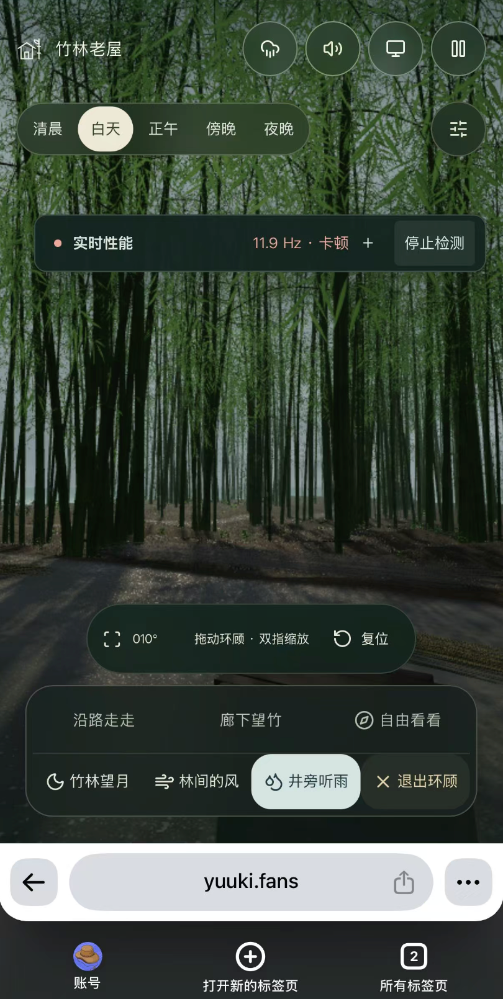

# 第五阶段：移动端持续负载、音频与采集重启

## 用户反馈与范围

父版本为已合入 `main` 的第四阶段，父提交 `c24ca123b308a7e5f94db56a7af97f81638d3c3a`。按用户本轮直接合入并推送的授权，本阶段继续在 `main`，与阶段 01–04 保留连续关系。

iPhone 16 Pro 的 Safari 与 Chrome 仍在操作约 10 秒后明显发热、卡顿，截图读数 **11.9 Hz**；点击“停止检测”后实际操作仍卡顿。Mac 端已有明显改善，因此本轮重点是移动端持续负载，不能继续将原因直接归结为性能记录累积。用户另要求停止后可以清空记录并重新检测。



所有改动接入共用场景、声音或诊断路径。保留雨量、遮挡精度、竹叶数量、材质、原始录音以及现有画质配置；默认仍是均衡清晰、隔帧阴影、60 帧上限。没有自动改用 30 帧、缩减模型或降低清晰度。

## 能确定什么，尚不能确定什么

- **采集器不是全部原因。** 用户停止检测后仍卡顿；上一阶段已验证历史有界，不能把“记录无限增长”当成本阶段已确认根因。
- **音频有实际的资源压力。** 基础录音与雨声原先各自 `Promise.all`，两组同时加载可重叠解码，原版浏览器记录最大并发 **8**。雨景连同蛙鸣共 9 段，主录音约 43–82 秒；在本机 44.1 kHz 上解码 PCM 合计 **172,466,312 字节（约 164.48 MiB）**。这不是压缩 MP3 大小，也不是 JS 堆或进程总内存。
- **长录音不等于泄漏。** 原代码缓存固定录音，循环结束会断开源节点；本轮连续播放观察中，解码次数和缓冲容量均保持不变。短期观察仍不能排除所有 iOS 原生资源问题。
- **渲染持续负载仍高。** 先前部分竹叶因为顶点输入占满而跳过风场缓存；另有相同 DPR 的重复 resize。它们是能从源码和回归中确认的额外工作，不足以单独解释真机全部掉帧。
- **温控是待验证假设。** 没有拿到这台 iPhone 的系统热状态、GPU 帧时或进程内存记录。桌面 Canary 的移动视口不是手机硬件，不能用它宣布 11–13 Hz 已消失。

## iPhone 高负载、音频与电池资料

Apple 说明，图形密集应用和无线充电会使设备变暖；温度过高时，系统可能降低帧率、增加处理时间、调暗屏幕，并减慢或暂停充电。过热环境也可能永久缩短电池寿命。这些机制与用户现象相容，但“摸起来热＋低帧率”不是独立的温控诊断。[Apple：设备过热或过冷](https://support.apple.com/en-us/118431)

**网页不能直接读出 iPhone 的处理器频率或系统温控等级。** 本面板测的是 RAF 回调间隔。原生 iOS 应用可读 `ProcessInfo.thermalState` 的 nominal / fair / serious / critical；该等级也不是具体 CPU/GPU 频率。Apple 在 serious 状态建议减少 CPU/GPU、I/O 和目标帧率。[Apple：thermalState](https://developer.apple.com/documentation/foundation/processinfo/thermalstate-swift.property)、[serious](https://developer.apple.com/documentation/foundation/processinfo/thermalstate-swift.enum/serious)

WebKit 对功耗的解释是：系统根据工作负载调节 CPU/GPU 状态和频率，高性能状态会消耗更多电量；网页应减少高功耗工作时间和无用唤醒。[WebKit：网页内容如何影响功耗](https://webkit.org/blog/8970/how-web-content-can-affect-power-usage/)

Web Audio 的 `AudioBuffer` 保存浮点 PCM，`decodeAudioData` 需要整个文件并按音频上下文采样率重采样。MDN 建议长音轨考虑媒体元素流式播放，短音效采用缓冲；因此“文件压缩后不大”不能推导“运行时占用很小”。[MDN：AudioBuffer](https://developer.mozilla.org/en-US/docs/Web/API/AudioBuffer)、[decodeAudioData](https://developer.mozilla.org/en-US/docs/Web/API/BaseAudioContext/decodeAudioData)、[加载建议](https://developer.mozilla.org/en-US/docs/Web/API/Web_Audio_API/Best_practices)

本轮没有直接改成多媒体元素流式播放：需要另外验证 iOS 手势解锁、多轨混音及现有六秒交叉淡入淡出，不能以接缝或丢失音层换内存。串行解码减少同时工作的解码器，**不减少全部录音最终驻留的 PCM 容量**，也不承诺首次声音就绪更快。

## 实际改动

### 音频：减少峰值和静音后的工作

- 移动设备的基础声、雨声及蛙鸣共用一条解码队列，最多一个 `decodeAudioData` 在运行。下载仍可并行，桌面保留原并行解码。
- 队列检查取消与销毁；已开始的浏览器解码不能强制中断，但完成后不再连接节点，未开始的任务会跳过。失败不会卡死后续重试。
- 静音或页面隐藏时取消 1.5 秒调度定时器，完成既有淡出后暂停 `AudioContext`；恢复时只建立一个定时器。
- 静音/隐藏/音频上下文不运行时，场景仍保存最新阵风和屋檐水量，但不逐帧写音频自动化参数。再次开启直接用最新状态混音，不重新解码。
- 音频文件、声道、采样率、滤波、循环重叠及音量公式保持原配置。

### 渲染：缓存相同的计算结果

原 `weatherSurfaces` 给实例化植被的每个顶点都上传 `rainExposure=1`、`rainIngress=(0,0,0)`。现在实例化着色器使用同值常量，释放两个顶点输入；建筑和其它非实例化表面的逐点遮雨属性保持原路径。

28 组挂枝的竹叶原占满 16 个输入，未能启用根部风场缓存。释放输入后，为每组实例缓存根部受力、父竹竿的轴向缩短及导数、次级枝条摆动。原先在每个顶点重复执行的曲线积分和三角函数，改为每实例计算一次。竹叶铰链、逐顶点形状、法线变形以及阴影材质继续采用原运动；输入不足时仍回退到解析着色器。

数值回归覆盖不同根位置、竹高、倾斜与四种风力、多个阵风周期；缓存重建的父级偏移、导数、次级摆动与原 CPU 对应公式误差小于 `1e-6`。这是计算级验证，不宣称 GPU 逐像素完全相同。

### 移动视口：避免重复重置缓冲

Three 的 `setPixelRatio()` 内部会调用 `setSize()`，即使 DPR 没变也重设画布宽高。原 resize 回调随后再次 `setSize()`，产生重复工作。

现在每个实际绘制帧只处理一次最新 resize；尺寸和 DPR 都未变时直接返回，仅 DPR 改变才调用 `setPixelRatio`。真实横竖屏及清晰度变化仍更新相机、室内后处理与转场目标。没有降低输出尺寸。

### 检测：停止 → 清空并重启

- 停止后保留最终记录用于导出，按钮变为 **清空并重启**；无须刷新场景。
- 重新开始时清除加载阶段、资源历史、实时窗口、场景诊断帧及阴影计数，重新建立一组 RAF / 观察器 / 刷新定时器。
- 业务 recorder 用会话编号隔离旧异步完成回调；新一轮不会被旧完成事件污染。`dispose()` 仍不可重开。
- 过滤重启前开始的资源请求，不回填旧导航；导出新增 `collectionStartedAt`，重启后的 `navigation=[]`。面板显示“本轮检测”，不会误报首屏重新加载。
- 不清浏览器 HTTP 缓存，不释放模型或录音，也不改变视角、天气、声音和画质。

## 验证及其适用范围

`pnpm check` 的类型检查、lint、**46 项测试**及 LOD 产物一致性检查通过；`pnpm build` 通过，保留既有的大 chunk 提示。新增重启测试先在旧实现上因没有 `restart()` 失败，修复后通过。

真实建筑几何夹具在父版本与本实现生成完全相同的雨水属性哈希：

```text
e6ba8b5d34a2b118264bb8725b2ab7189100647e330bee155d7602623c7af212
```

两者均覆盖 1,131,197 个表面顶点，114,408 个有入口淋雨分量的顶点。本次只有一轮一致性核对，不用其 CPU 耗时计算性能收益。

独立、可见的 Chrome Canary 156、Apple M4 / ANGLE Metal，402 × 874 CSS 像素、DPR 3 的浏览器验证：

| 检查 | 观察 / 验收 |
| --- | --- |
| 默认与完整清晰度 | 默认 603 × 1311，完整 804 × 1748；配置未改 |
| 停止全部检测 | 定时器 1 → 0，诊断 RAF 1 → 0，观察器 2 → 0，业务计时关闭；场景继续绘制 |
| 三次清空重启 | 每次仅恢复 1 个定时器、1 个 RAF、2 个观察器；旧加载/导航/资源没有回填 |
| 新请求和导出 | 仅保留本轮开始后的资源，请求与 RAF 时间均不越过本轮起点 |
| 音频与静音 | 9 段录音，解码最大并发 1；静音后定时器 0、上下文 suspended；重新开声复用缓冲 |
| 额外持续播放 90 秒 | 超过最长录音，PCM 总量和解码次数不变；同时存在的源峰值 14，包含提前调度与交叉淡出 |
| 着色器 / 视角 | 步行、廊下、林间的风、井旁听雨、竹林望月、自由视角一楼堂屋；另在完整效果下遍历全部 8 个室内外地点 × 白天/夜晚，并触摸环顾（16 组）；未见页面异常、着色器错误或静态回退 |
| resize | 同尺寸 30 个事件不重置画布；横竖屏仍达到对应真实输出尺寸 |

初次音频和持续播放验收早于最后的 resize 改动；最终构建再次检查质量、横竖屏、停止重启和声音生命周期，跳过重复的 90 秒等待。两份记录分别保留，避免把中途记录伪装成最终完整运行。

此外使用 GPU timer query 对步行、廊下、雨景、月景做过短采样，四种视角主场景 GPU 中位数大致仍在 10–12 ms。前后采样不是重复交叉实验，动态天气和时钟也不完全相同，**不据此宣布百分比提升或推算 iPhone FPS**。早期关雨/关植被消融中相机和视角变化，已判为无效对照，只保留可独立核实的录音容量事实。

### 可复现与归档

- 脚本：[mobile-runtime-smoke.mjs](../../../scripts/perf/mobile-runtime-smoke.mjs)，[运行说明](../../../scripts/perf/README.md)。
- [音频解码与雨水属性证据](./evidence/tidewater-05-audio-and-rain.json)。
- [持续播放及重启验收](./evidence/tidewater-05-audio-soak.json)。
- [完整效果下全部地点走查](./evidence/tidewater-05-all-places.json)。
- [最终功能验收](./evidence/tidewater-05-acceptance.json)。
- [最终清空重启界面](./evidence/tidewater-05-restarted-mobile.png)。
- [源码、构建及证据清单](./evidence/tidewater-05-manifest.json)。

本地额外排查数据位于 `outputs/performance/mobile-runtime-05/`，未将原始 CPU profiles 或无效消融作为发布证据。

## iPhone 后续复测

先让设备自然冷却，在相同亮度、低电量模式、充电状态、视角、天气、清晰度与声音条件下，记录初始、10、30、60 秒读数及实际拖动感觉。避开直晒，避免无线充电同时测试造成额外热源。没有温度警告也不能据此排除系统已经采取限制；系统不会把每次降频直接通知网页。[Apple 温度管理说明](https://support.apple.com/en-us/118431)

分别对照声音开启/关闭和检测开启/停止。若同条件下随升温下降、冷却后恢复，温控解释更有支持；若主要停顿发生在首次声音加载，则继续检查解码与本机内存。不能为判定温控额外在手机上运行忙循环压测。

已有 **省电 30 帧** 可由用户主动选择，保留清晰度但降低运动连续性；它是上限，不保证已热到 12 Hz 的设备能立即恢复到 30。网页应减少持续 CPU/GPU 和无效唤醒，不能绕过 iPhone 的热保护；不将省电模式或电池健康页当作实时降频仪表。

调查状态：**DONE_WITH_CONCERNS**。已完成有证据的重复计算、解码峰值、静音调度及采集重启修复；iPhone 16 Pro 上的发热和 11–13 Hz 是否改善，仍需要真机复测。
