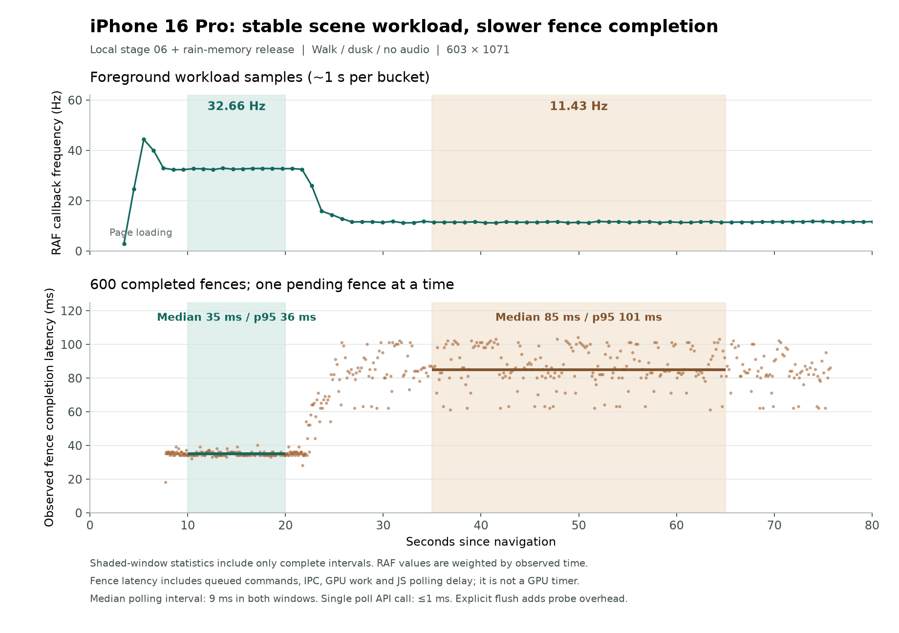
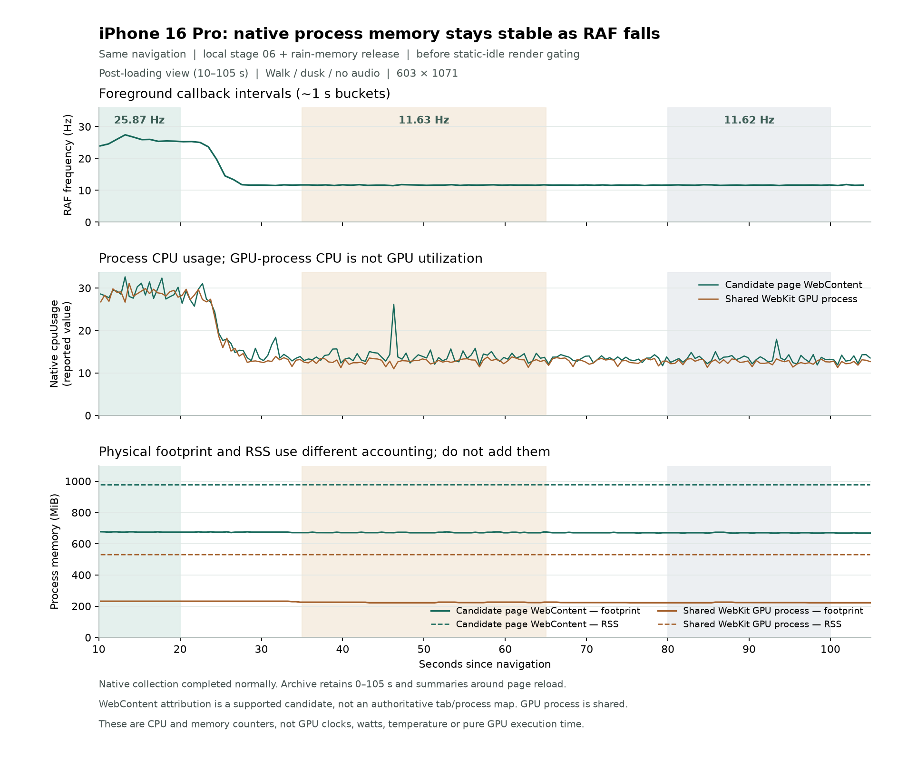

# 第六阶段：移动端 GPU 缓冲驻留与持续负载证据

> 2026-09-26 归档：动态播放时的 iPhone 持续掉帧仍未解决。本次仅提交调查文档与证据，所述实现仍在本地工作区、未作为生产修复提交或推送。先读[调查检查点](../iphone-investigation-status.md)了解当前结论、代码状态与后续验证；本篇保留完整实验和各轮边界。后续本地加入静止按需绘制，完整检查已增至 61 项测试；下面早期的 56 项为该轮验证记录。

## 用户反馈与父版本

父版本为第五阶段提交 `e23daec77945c4b70d07f0956a9bcdc12232fe45`，本阶段按用户已授权的方式继续在 `main`，完成验证后提交并推送。

第五阶段之后，iPhone 16 Pro 仍会在切换多个视角后很快降到约 **10–13 Hz**，设备发热。用户确认修改现有画质配置没有明显影响；进一步做过声音开启/关闭对照，两种情况均会卡顿。因此，本轮将音频从主要假设中移除，重点检查切换后的 GPU 资源驻留、额外渲染目标和随运行时间变化的负担。Mac 端改善不能证明 iPhone 问题已经解决。

范围仍是整个体验的共用渲染路径。默认继续采用均衡清晰、隔帧阴影、60 帧上限；完整效果及原有配置均保留。本轮不改变模型、竹叶数量、雨效、材质、场景输出尺寸、主体画面的抗锯齿或阴影设置。

## 真机日志能说明什么

输入为用户提供的 `bamboo-performance-2026-09-26T08-02-25-523Z.json`，捕获时间为 `2026-09-26T08:02:25.522Z`。

| 观察 | 数值或边界 |
| --- | --- |
| 本轮采集起点 | 导航后约 180.11 秒，属于清空后重启的检测 |
| 导出时刻 | 导航后约 404.01 秒 |
| 最后 5 秒 RAF 频率 | 约 9.36 Hz；47 个完整间隔，合计约 5019 ms |
| 最后 5 秒间隔 | p95 124 ms，最大 129 ms；47 个间隔均超过慢间隔阈值 |
| 当时状态 | 沿路步行、白天、暴雨；声音开启；完整清晰度、完整阴影、跟随屏幕 |
| 绘制规模 | 804 × 1516，DPR 2；约 443 次绘制、906 万三角形、136 张纹理、266 个几何体 |
| 历史边界 | 实时图仅保留最近约 30 秒；Long Tasks 在该环境不受支持，其空值不能解释成没有主线程阻塞 |
| 快照分配 | 本轮记录了 22 次，多数伴随浏览器地址栏高度或清晰度变化；最后一次约在 284.76 秒，末尾约 119 秒没有快照分配 |

这份日志确认了**加载结束很久之后仍持续低频**。它没有覆盖页面最初约 10 秒的退化过程，也没有开始阶段的 GPU 资源历史；仅凭最后一份资源快照，无法判断某类资源此前增长了多少。记录中的 discarded / dropped 是因容量限制而丢弃的累计条数，不等于仍保留着同样多的数据。

快照分配确实存在可避免的重复工作，但末尾长期没有该事件，不能把它写成持续低频的唯一根因。用户后续完成的声音对照比该日志中单一的“声音开启”状态更有区分力，本轮不再通过这份日志推断音频导致卡顿。

还有一个限制：真机末端的 **136 张纹理 / 266 个几何体**与本机尚未进入室内时的计数相同；本机首访室内后可升至约 **153 / 268**。不同设备和路径的资源计数不能单独证明用户从未进入室内，但这份日志也不支持“室内目标常驻就是此次 9 Hz 的主因”。本轮定位是修复已确认的 GPU 资源浪费，并补齐下次真机分析所需证据。

## Three.js 与 WebKit 问题对照

按用户要求查阅 Three.js GitHub issue，并核对本项目的版本、渲染器和触发条件。

| 上游报告 | 与本项目的关系 |
| --- | --- |
| [Three.js #34599：Android Chrome 的 MSAA render pass 卡顿](https://github.com/mrdoob/three.js/issues/34599) | 报告使用与本项目相同的 Three.js 0.185.1，涉及 `EffectComposer` 和 MSAA；报告者关闭渲染目标的 MSAA 后变平稳。这支持检查中间缓冲与带宽，但其设备和系统是 Android，不能当作 iPhone 已命中同一缺陷的证明，也不能据此关闭本项目主体画面的抗锯齿。 |
| [Three.js #30047：Safari 的多个 WebGL 上下文残留](https://github.com/mrdoob/three.js/issues/30047) | 本项目视角切换复用同一个 renderer 和上下文，未找到每次切换新建上下文的路径，触发条件不匹配。 |
| [Three.js #30416：Safari 的 ImageBitmap 内存占用](https://github.com/mrdoob/three.js/issues/30416) | 本项目移动端已为 GLTF 使用串行 `TextureLoader`，避开该报告讨论的 `ImageBitmapLoader` 路径，不能将旧方案再次列作新修复。 |
| [Three.js #26183：sRGB 纹理更新性能](https://github.com/mrdoob/three.js/issues/26183) | 主要讨论视频/画布纹理逐帧上传及颜色转换；本项目静态模型纹理不按帧重新上传，没有对应证据，不修改颜色空间或色彩呈现。 |

没有找到能直接证明“升级 Three.js 即可解决这台 iPhone”的已确认修复。因此本轮保留现有版本，只处理源码和资源路径中可核实的额外负担。

### Babylon.js 报告提供调查方法，不能直接套用根因

用户补充的 [Babylon.js #62697](https://forum.babylonjs.com/t/potential-memory-leak-in-webgpucachebindgroups/62697) 是一份有具体复现过程的缓存泄漏报告：作者每秒创建并销毁多条共享材质的 `GreasedLine`，两次相隔约 2 分钟的 JS heap snapshot 增加约 7 MB，主要保留对象指向 `WebGPUCacheBindGroups`；作者的 WebGL2 对照未发现相同泄漏。维护者确认缓存原先假定条目会复用、没有定期清理未使用条目，并建议复用 mesh。帖子包含 AI 分析，但本轮依据的是作者的对照与维护者回复，不把引用的 AI 推断单独当成证据。

本项目使用 Three `WebGLRenderer`，源码中没有该 Babylon WebGPU 缓存类或 `GreasedLine` 创建/销毁路径，因此不能把这一问题直接写成本项目的泄漏。可迁移的方法是：检查切换前后相同工作集的缓存数量与引用链，确认已退出使用的对象是否仍被缓存强引用；把首次访问增加、达到稳定工作集和持续增长分开。Three 及底层 GL 句柄计数稳定，仍不等于已经测量了浏览器/驱动内部全部分配。

另外两份第一手报告与本次“运行一段时间再降速”更接近。[Babylon.js #54541](https://forum.babylonjs.com/t/2x-fps-drop-after-spending-20-seconds-ios-18/54541) 最初记录 iPhone 14 Pro Max 约 20 秒后从 60 降到 30 FPS 或更低；2024 年 12 月另有 iPhone 16 Pro 使用者报告约 15 秒后从 60 降到 30 FPS。维护者在 SE 和 iPhone 13 上没有复现，帖子对过热的说法仍是猜测，没有系统热状态测量。

同一位 iPhone 16 Pro 使用者在 [Babylon.js #56952](https://forum.babylonjs.com/t/webgpu-ios-framerate-drop/56952) 提供同一 playground 的 WebGL/WebGPU 对照，随后纠正了“升级 Babylon 后 WebGPU 也变慢”的判断：iOS 更新重置了 WebGPU 功能开关，测试实际回退到 WebGL。确认启用 WebGPU 后，他报告约 30 分钟仍为 60 FPS；但另一位维护者的 iPhone 16 Pro Max 未复现掉帧。这是值得验证的后端差异线索，尚无确定的系统/驱动根因，也不能推导所有 iPhone 16 都受影响或本项目切换后端必然解决问题。

外部同场景、同设备的 WebGL/WebGPU 对照目前尚未完成有效采样，本报告不记录其性能结果，也不据此变更本项目后端。后续必须核实实际创建的后端，避免把功能不可用后的 fallback 当成 WebGPU 测试。

### iPhone 上 Safari 与 Chrome 的对照边界

Chromium 的 iOS 源码明确通过 `BuildWKWebView` 创建显示网页的 `WKWebView`，并导入 Apple WebKit 框架。因此，用户在 iPhone 的 Safari 和 Chrome 都遇到掉帧，**不能排除二者共有的 WebKit、系统合成或 GPU/驱动路径**；这与在桌面 Chrome 和 Safari 中比较两个渲染引擎不同。这里没有据浏览器名称反推手机上某个具体 WebKit 缺陷已被证实。[Chromium iOS 网页视图创建接口](https://chromium.googlesource.com/chromium/src/ios/+/4f9503343a76507ddcf1a4f2059121a8b4d01843/web/web_state/web_view_internal_creation_util.h)

## 源码与对照观察

- 场景只建立一组持续 RAF，创建 effect 只随重新载入次数改变。切换视角只改变相机、地点和失效标记，没有重复建场景或叠加渲染循环。
- 夜间固定点光源的阴影缓存一次，白天灯会退出可见灯光列表；没有证据表明切回白天仍永久多做七个点光源阴影 pass。
- 程序和纹理会在首次进入室内、夜间时增加。Mac WebKit 多轮遍历中，纹理约从 136 增至 153，程序约从 81 增至 262，随后基本稳定。这是首次访问扩充的工作集，不能仅凭“比打开时多”认定泄漏。
- Three 的 VAO 缓存按几何体、实例对象和程序变体组合保留，原纹理/几何体计数并不覆盖它。补充探针观察到基线打开时约 446 个，首轮夜间约 1332 个、白天约 1502 个；完整两轮后为 1548，两轮返回值一致；Programs 267、Buffer 1348 也不再增加，不能将首次扩充写成泄漏。
- 原室内管线虽然回到户外后不再绘制，已经分配的两张全尺寸 HDR 目标及两组 AO 目标仍保留 GPU 存储。移动端地址栏变化还会使闲置管线跟随 resize。
- 原全屏接触阴影合成目标继承了主体目标的 MSAA 和深度配置；AO 与降噪的全屏结果目标也带有不参与计算的深度缓冲。这些附件有明确的移除依据。
- 原转场快照在每次真实 resize 后立即分配，即便当时并没有转场请求。

Mac WebKit 的受控复测覆盖全部 8 个室内外地点 × 白天/夜晚 × 2 轮，回到相同相机后仍约 60 Hz。另一次有界面运行曾观察到约 6 Hz，但缺乏前后台与窗口调度控制，不能作为手机问题已在 Mac 复现的证据。上述检查用于核对路径、资源和功能，**不是 iPhone 的 FPS 改善数据**。

## 实际改动

### 保留主体 MSAA，去掉全屏处理不用的附件

室内主体画面继续使用原来的全尺寸半浮点 HDR 目标与 MSAA：移动端 2 samples，桌面 4 samples。主体的颜色、几何边缘和深度测试继续在原配置下完成。

接触阴影合成只处理已经解析完成的主体图像，是覆盖目标的全屏绘制；该中间目标改为单采样并移除深度缓冲。当前 RenderPass 不交换缓冲，接触阴影和 OutputPass 各交换一次，因此每帧结束后读写角色保持一致；回归需同时确认多帧交换过程，避免把主体画面意外写入单采样目标。

主体目标继续保留用于几何绘制的深度存储，但关闭后续没有消费者的深度 resolve。两组 GTAO 的 normal/depth 输入保持原设置，仅从 GTAO 结果和降噪结果目标移除未使用的深度附件。AO 分辨率、采样数、强度、运动时切换及静止后的细节恢复保持原配置。

这与直接关闭整个室内画面的 MSAA 不同。改动依据是附件没有被使用；最终数值与视觉验收仍需核对，不能仅凭配置推导 GPU 逐像素一致。

### 移动端离开室内后释放目标存储

移动端回到户外时，对室内管线的 **8 个 render target** 释放 GPU 存储。材质、程序和管线对象继续复用，不因每次进屋重新构造整套后处理。

再次进入室内时按当前尺寸恢复目标，并使接触阴影缓存失效，首帧重画完整细节 AO。处理准备期间离开的情况，避免异步准备在离开后重新留下存储。桌面保留原有驻留策略。

释放闲置存储会把分配工作移到下一次进屋；需要核对连续往返时的首帧耗时。不能将“户外不再常驻这些目标”表述为“所有 GPU 内存已经下降到同一个固定值”，因为模型纹理、阴影、程序与浏览器自身仍有各自生命周期。

### resize 只保留最终尺寸所需工作

室内 composer 统一以物理像素尺寸管理，尺寸变化时只设置最终宽高，避免先将新 DPR 套用到旧视口、再设置新视口的中间过程。

转场快照在 resize 后已经不再匹配画面，因此立即失效并释放；直到下一次 capture 真正需要快照时才重新分配。真实切换继续保留原有 220 ms 淡入淡出。若 resize 打断正在交接的请求，仍完成调度回调，不把导航卡在等待状态。

### 记录开始阶段和退化阶段的工作量

导出的 `runtime.workload` 增加低频、有上限的历史：每累计约 1 秒前台 RAF 间隔记录一次，保留本轮最初 **60 条**和最近 **120 条**，相当于通常情况下的最初一分钟和最近两分钟。隐藏时间不补采、不填充伪造样本；超出的中间记录丢弃并累计计数。

每条将 RAF 频率与当时的视角/天气/设置、绘制规模、纹理/几何体/程序数量及 CPU 时间放在同一时间点，帮助下一份真机日志判断是工作量增加，还是相同工作量变慢。

`cpuUpdateMs` 与 `cpuRenderSubmitMs` 是场景最近一组 **15 个通过帧率调度的场景更新 tick** 的平均值，不是该一秒区间的平均，也不是 GPU 执行时间。若 tick 没有提交绘制，其提交耗时按 0 参与平均；这里记录的历史真机基线尚未启用静止画面跳过提交，因此那些基线中的更新 tick 与实际绘制帧相对应。`cpuRenderSubmitMs` 可能包含浏览器或驱动等待，不能直接解释为纯 JavaScript 运算成本。正式采集器没有添加 `gl.finish()` 或像素回读；后文的临时诊断调用已在实验结束后移除。

停止检测后不继续收集这些历史或 CPU 时间；清空并重启重置历史、累计计数与尚未完成的采样区间。它们继续服从已有的停止/重启生命周期，不建立第二组独立常驻检测循环。

### 雨效烘焙结束后释放不再使用的精确索引

全场景湿润、遮雨属性烘焙完成后，精确查询索引原本仍由闭包持有。本轮释放这组约 **71.11 MiB** 的 TypedArray 容量与查询缓存，保留运行时雨滴碰撞使用的体素数据；雨量、遮挡和湿润属性不变。这里的容量表示对象引用解除后可回收的数组存储，并非已经测得 iPhone 进程内存下降了同样多的字节。生命周期边界、实际模型属性哈希与雨滴模拟一致性见本阶段附录[雨效烘焙数据释放](./007-rain-bake-memory.md)。真机复测结果见后文：它消除了已确认的无用驻留，但未消除约 20 多秒后的退化。

## 目标存储估算与适用边界

以用户日志中的 **804 × 1516**、移动端 MSAA 2 和当前半浮点/深度附件布局计算，室内目标的理论存储规模如下：

| 状态 | 目标附件估算 |
| --- | ---: |
| 原室内布局 | 约 96.77 MiB |
| 去除冗余附件后的室内布局 | 约 61.32 MiB |
| 差值 | 约 35.46 MiB |
| 新版离开室内后 | 释放这组目标已分配的 GPU 存储；再次进入时恢复 |

这是依据尺寸、像素格式和样本数的**附件容量估算**，不是 iPhone 实测进程内存、峰值内存或 GPU 显存读数。浏览器是否使用多采样扩展、深度实际格式、行/页对齐及驱动内部副本都会改变实际值；它也不包含模型纹理、着色器程序、默认画布、转场快照和系统合成器。各行分别四舍五入，差值由未取整容量计算。

## 验证与证据

`pnpm check` 通过：类型检查、lint、56 项测试及 LOD 产物一致性；`pnpm build` 通过，保留既有的大 chunk 提示。测试覆盖真实 Three composer 连续帧的缓冲角色、主体 MSAA、纯全屏附件、释放后完整 AO 重入、异步准备期间退出、resize 与重复释放，以及雨效精确索引释放后保留运行时碰撞数据、重复释放和销毁的生命周期。

最终构建在 Mac 上分别使用 Chrome Canary 156.0.8075.0 和 WebKit 26.5，移动视口、完整画质，完成 **8 地点 × 昼夜 × 2 轮**，两套均无页面、控制台或着色器错误。回到室外后的资源如下：

| 资源 | 原版 Canary | 新版 Canary / WebKit |
| --- | ---: | ---: |
| Three 纹理 | 153 | 146 |
| 存活 Framebuffer | 66 | 59 |
| 存活 Renderbuffer | 9 | 1 |
| Programs / VertexArray / Buffer | 267 / 1548 / 1348 | 267 / 1548 / 1348 |

室内 Renderbuffer 从 9 降至 4，回室外后再降至 1。两个往返轮次资源不再增长。这个计数包含转场快照变化，不能用“纹理少 7 张”推导全部字节量。

固定随机种子与减少动态的前后 36 个采样，相机、风时间、输出尺寸、地点、时段、draw calls 和三角形均一致。开场和两次返回的 **3 张室外图逐像素一致**；**6 张室内图存在微小数值差异**，平均绝对通道差为 0.0113–0.0342 / 255，最大单通道差 5–7 / 255，没有像素通道差超过 8。堂屋前后图目视未见差异，但不能声称室内 bit-exact。

检测回归验证了前 60 + 后 120 的容量上限、缺口、深拷贝、非法 adapter 数据和暂停/隐藏/清空。实际浏览器停止后 13 条 workload 完全冻结，检测 RAF、刷新定时器和 observer 均为 0；继续游览及变更画质仍可正常绘制。三轮清空重启都从空历史开始，生成新的有效 CPU / 程序样本。

- [GPU 管线、图片差异与两套浏览器证据](./evidence/tidewater-06-pipeline-validation.json)
- [停止、清空重启与最终功能验收](./evidence/tidewater-06-acceptance.json)
- [真实 iPhone 的暂时性消融记录](./evidence/tidewater-06-iphone-probes.json)

## 连接 iPhone 后的直接对照

用户将手机连接 Mac 并开启 Safari 远程检查后，已直接读到当前线上版本的持续低频。开发菜单报告 iOS 26.6.2，页面在前台；均衡清晰、隔帧阴影、60 帧上限，林间的风 / 白天 / 大风，输出 603 × 1071，136 张纹理和 266 个几何体。

下表来自线上第五阶段版本、同一手机和相同相机下的短暂实验。它们故意临时省略部分绘制来定位负担，**不是产品优化，也没有写入正式画质设置**。每组结束后恢复原方法。

| 暂时性对照 | 最近 5 秒 RAF 频率 | 解释范围 |
| --- | ---: | --- |
| 正常绘制 | 10.51 Hz | 场景 RAF 回调 CPU 均值约 12.94 ms，检测回调约 0.40 ms |
| 去掉界面 backdrop blur | 10.44 Hz | 当前对照未支持界面模糊是主要瓶颈 |
| 恢复界面模糊 | 11.31 Hz | 保留用户视觉设置 |
| 跳过全部 WebGL draw，保留逻辑/检测/上传 | 59.99 Hz | 绘制路径对持续低频有明确影响；不是检测数量不断增长的解释 |
| 恢复全部绘制 8 秒后 | 30.43 Hz | 随后用户也观察到约 30 秒再回落至 10–12 Hz，短时恢复不等于修复 |
| 跳过实例化绘制 | 16.94 Hz | 去掉植被仍不能恢复满速；恢复后 11.23 Hz |
| 跳过非实例化绘制 | 15.80 Hz | 去掉建筑/地表等仍不能恢复满速；恢复后 11.24 Hz |
| 跳过非默认 framebuffer 上的阴影绘制 | 11.08 Hz | 恢复后 10.90 Hz，因此没有实施高复杂度的静态阴影分层缓存 |
| 默认画布仅允许 1 像素 scissor | 14.95 Hz | 保留顶点提交，仅压低光栅/片元覆盖；恢复后 10.58 Hz，不能仅归咎分辨率 |

这些实验支持继续定位主画面的 GPU/驱动负担。Safari 没有提供 `EXT_disjoint_timer_query_webgl2`，因此没有 GPU 执行毫秒数据。早期 DVT sysmon 的 `--native` 路径未取得有效采样，当时只读查询显示 Developer Mode 为 `false`、已挂载开发者镜像为 `[]`。随后已明确前一次退出发生在 **Mac 端 Python/XPC teardown**，SIGKILL / 137 并非手机网页进程崩溃；改用 `--userspace` 后成功完成原生进程 CPU、RSS、physical footprint 等采集，**没有下载或挂载开发者镜像**，详见后文。上述前置状态不能继续写成原生采样的未解决阻碍。当前仍没有原生 GPU/CPU 时钟、物理温度或 `ProcessInfo.thermalState` 等级。普通系统日志已捕获到 WebContent 的热缓解状态变化，但它也不等于实际硬件降频测量。手机连线时存在外接电源，亦需与独立使用区分。

不依赖 DVT 的普通 syslog 采集最终成功。此前的空输出只表示当时未取得消息，不能作为没有热压力或服务失效的证据。原始日志含设备与进程信息，仅保存在本地；提交的证据只保留限定时段内的状态、时间和工作量，移除进程 ID、UUID、地址与设备路径。Apple 也提供通过 macOS 控制台读取连接设备日志及复现时生成 sysdiagnose 的路径。[设备日志说明](https://support.apple.com/en-asia/guide/console/cnsl1012/mac)、[Apple sysdiagnose 操作说明](https://podcasters.apple.com/assets/iOS-sysdiagnose-logging-instructions.pdf)

所有拦截底层 WebGL draw 的实验都需要区分两层计数：Three 的 `renderer.info` 仍按应用请求累计，而拦截器可能随后减少或跳过真实绘制。因此这些阶段的 `renderer.triangles` 不能当作实际送到 GPU 的三角形数。

### 第六阶段构建在真机上仍会持续低频

随后在同一手机加载本地第六阶段构建，**仍然复现了约 10–13 Hz 的户外持续低频**。因此，室内附件与驻留修复虽然有可验证的资源收益，尚未解决用户报告的问题。下面记录继续排除的假设，包括没有得到持续收益的实验，避免把一次短暂恢复误写为优化成功。

| 临时实验 | 结果 | 可以得出的结论 |
| --- | --- | --- |
| 屏蔽动态 `bufferSubData` 上传，望月视角 / 夜间 / 晴风 | 基线 11.64 Hz，屏蔽 12 秒后 11.65 Hz，恢复后 11.57 Hz；相机和状态保持一致 | 屏蔽阶段实际跳过 8,180 次、约 1.58 MB 上传；三个阶段均没有 `texImage2D` / `texSubImage2D` 调用。此次持续低频没有因取消动态上传而恢复，不支持把上传不断累积作为该状态的主要解释。 |
| 重建默认画布为 `antialias:false`，回到林间的风 / 白天 / 大风 | 上下文属性确认关闭 AA；导航后约 48.89 秒仍为 12.00 Hz | 关闭默认画布 AA 也未避免持续低频。AA 开启的另一轮末端为 11.54 Hz，但两轮的运行时长、声音与此前访问路径不同，不能据此计算 AA 的帧率收益。主体 AA 保留。 |
| 每次主体 render 后调用 `gl.finish()`，相机保持不变 | 10.50 → 10.73 → 10.46 Hz；15 秒内 158 次调用合计约 1 ms | 该调用没有恢复流畅；返回耗时不能解释为 GPU 只用了约 1 ms，也不能据此排除 GPU 等待。 |
| 主体 render 后同步读取中央 1 像素 | 122 次读取合计约 7,687 ms，平均约 63.0 ms，最大约 84 ms | 读取确实暴露了等待，但期间用户移动相机、切换视角和改变了画布高度，三个阶段均 `cameraStable:false`；不能把 RAF 前后数值作为受控性能对比，也不能把 63 ms 等同于纯 GPU 绘制时间。 |

AA 关闭的记录还补上了此前缺失的退化过程：同一林间视角、603 × 1071、相同设置下，约 24.19 秒的 1 秒样本为 34.79 Hz，约 26.31 秒为 16.65 Hz，约 28.36 秒为 12.40 Hz，之后维持约 12 Hz。在这一段中，Three 程序 / 纹理 / 几何体一直为 **81 / 136 / 266**。记录中的约 924.7 万与 528.4 万三角形是有、无隔帧阴影提交的两类帧，不是场景几何持续增加。稳定计数不等于所有驱动内部内存均已被测量，但已经不支持“这些已观测资源数量一直变多”这一解释。

`finish()` 的特殊边界另核对了 WebKit 源码：当前 `main` 的网页进程代理通过普通 `send(Finish)` 发送消息，GPU 进程再执行实际 `finish()`；这里不是等待结果的 `sendSync`。因此，JavaScript 侧近乎立即返回与这种分进程机制相符，不能拿它当 GPU 计时器。源码来自当前主分支，**没有证明与手机 iOS 26.6.2 的确切构建逐行相同**。[网页进程代理](https://github.com/WebKit/WebKit/blob/main/Source/WebKit/WebProcess/GPU/graphics/RemoteGraphicsContextGLProxyFunctionsGenerated.cpp#L533)、[GPU 进程处理](https://github.com/WebKit/WebKit/blob/main/Source/WebKit/GPUProcess/graphics/RemoteGraphicsContextGLFunctionsGenerated.cpp#L377)。

### 风动着色器的短时改善未通过延长验证

在保持 CPU 风场计算、上传、几何、片元材质和绘制提交的情况下，临时替换顶点函数，分别跳过整体摇摆、叶片铰链旋转或两者。实验覆盖 110 个带风对象；相机、投影、视角设置、几何引用和索引均保持一致，页面在前台，未出现着色器错误。临时修改会改变植物位置、覆盖范围和着色器有效输入，因此也不能只把结果归因于某一类 ALU 运算。

短实验末端读数依次为：基线 **9.82 Hz**，去整体摇摆 12 秒后 **27.71 Hz**，恢复后 **15.27 Hz**；去叶片旋转后 **9.68 Hz**，恢复后 **10.02 Hz**；两者同时去掉后 **10.61 Hz**，最终恢复为 **9.68 Hz**。这些结果不具备“省掉更多计算就持续更快”的一致性，所以没有据此修改正式风动效果。

追加的完整长实验否定了把 27.71 Hz 当成持续收益的做法：基线 **10.67 Hz**，去整体摇摆连续运行约 **60.03 秒**后的最后 5 秒仍为 **9.88 Hz**，恢复原效果再运行约 **35.02 秒**后为 **10.08 Hz**。全部阶段相机、投影、状态和几何一致；102 条过程记录与完整阶段结果均已归档。

这组长实验内，存活 Texture / Buffer / Framebuffer / Renderbuffer 保持 **158 / 1346 / 59 / 1**。编译临时材质使 Program 从 149 增至 180、VAO 从 1103 增至 1281，属于实验引入的变体；最终恢复原材质并释放 70 个临时克隆后，Program 返回 149。不能把诊断自身的临时变体计作产品泄漏，也不能把这些句柄数量当作显存字节。

### 缩小每次实际绘制，保留原有调用流程

为区分“调用很多次”与“每次调用实际处理很多几何”两种负担，下一组实验保留原有材质、上传和每帧 WebGL 绘制调用流程，仅在调用底层 draw 时把顶点/索引元素数量限制为最多 3、实例数限制为最多 1。它会破坏正常画面，**只用于定位，未加入产品配置或正式渲染路径**。

同一林间视角、白天、大风、603 × 1071 下，基线为 **9.90 Hz**；截短绘制连续运行约 **15.00 秒**后，最后 5 秒为 **59.99 Hz**，p95 17 ms；恢复完整绘制再运行约 **35.00 秒**后，回到 **10.32 Hz**。三阶段的相机和设置一致，程序 / 纹理 / 几何体保持 **149 / 145 / 267**。

截短阶段实际执行了 **303,524 次**被拦截的绘制调用，截短后的顶点/索引 `count` 合计 **910,572**。这些是整个 15 秒阶段的累计值，频率恢复后每秒调用次数也会增加，并不是“每秒调用次数固定”的对照；索引 `count` 也不等于去重后的顶点着色器执行次数。探针保留的 `instances:0` 字段没有累加实现，不能解释成没有实例绘制。与此同时，Three 快照仍显示约 924.7 万三角形，那是截短前的应用请求计数，不是本阶段实际绘制量。

这一结果表明，即便保留绘制调用流程，显著减少每次调用的实际工作也能恢复接近 60 Hz；持续低频不能仅用 JavaScript 调用次数解释。但缩小几何也同时改变图元组装、覆盖面积、片元和带宽负担，仍不能据此确认顶点着色器中的某个函数是根因。

### 同时压低全部 framebuffer 的像素覆盖

此前的 1 像素实验只限制默认画布，后续将限制扩展到所有 framebuffer，包括阴影和其他离屏目标；几何提交数量保持原值。基线为 **10.15 Hz**，全部目标限制为 1 像素连续运行约 **45.00 秒**后为 **15.15 Hz**；恢复完整绘制再运行约 **35.01 秒**后为 **11.30 Hz**。三阶段相机、设置、输出尺寸和上述资源计数均一致。

该实验大幅限制像素覆盖仍未恢复接近 60 Hz，结合截短绘制的结果，支持继续检查几何处理、图元处理以及相关 GPU/驱动成本；单独减少输出像素并不足以解释或消除这次低频。scissor 也不是各 GPU 阶段的计时器，不能据此精确分摊顶点、片元或驱动耗时。两组完整实验均已恢复原方法；当前仍没有实施新的几何删减或改变画质默认值。

### 捕获到热缓解信号，但它晚于本轮掉帧开始

新的同轮记录将页面 `performance.timeOrigin = 1790424606338` 与设备日志按 `+08:00` 对齐，导航起点为 **2026-09-26 20:10:06.338**。只选取导航后 0–80 秒：共有 73 条 workload，实际覆盖 0.340–79.209 秒；状态一直是沿路步行 / 傍晚 / 晴风、均衡清晰、隔帧阴影、60 帧上限，声音关闭。后续 Float32 属性转换实验在约 90.137 秒的基线结束之后才开始，本节没有使用它修改几何后的样本。

| 相对导航时间 | 观测 |
| --- | --- |
| 4.109 秒 | WebContent 日志报告热缓解未启用 |
| 22.069 秒 | 约 1 秒 workload 为 31.90 Hz |
| 23.087 秒 | 27.50 Hz，开始明显下降 |
| 24.101 秒 | 15.78 Hz |
| 25.175 秒 | 13.04 Hz |
| 27.227 秒 | 10.92 Hz |
| 33.704 秒 | 系统日志报告热缓解启用；紧随的 Page 日志为 `thermal mitigation 1, aggressive thermal mitigation 0` |
| 33.760 秒 | 相邻 workload 为 10.94 Hz |
| 79.209 秒 | 仍为 11.23 Hz |

这次确实观察到了浏览器收到的**热缓解信号**，不再只有用户的发热体感。但是，该通知比明显掉帧开始晚约 **10 秒**，在约 11 Hz 稳定之后才出现；因此不能写成“这个通知触发了掉帧”或“WebKit 已直接把页面锁到 10 Hz”。日志也没有测得通知之前的硬件温度、频率或更底层的电源管理变化，不能反向证明较早的退化与热压力无关。

同轮还有一条不能遗漏的反向观察：**20:12:15.041387**，即导航后约 **128.703 秒**，Page 日志变为 `thermal mitigation 0, aggressive thermal mitigation 0`，相邻过程样本仍约 **11.08 Hz**。当时已在后续 Float32 属性对照中，因此这段单独记录，不混入上面的 0–80 秒原始几何基线。该完整对照的三个末端读数是 **10.93 → 11.32 → 11.61 Hz**，中间使用 Float32 静态属性连续约 60 秒，最后恢复原属性再运行约 35 秒；它没有恢复流畅。热缓解关闭后仍低频，进一步不支持把这一个布尔信号解释为简单的 WebKit RAF 热锁，仍不能排除其他系统/GPU 电源管理状态。

从场景就绪的 **5.962 秒**到窗口末尾，Three 纹理 / 几何体 / 程序始终为 **136 / 264 / 81**，画布始终为 **603 × 1071**。记录的两类帧分别为 **229 draws / 5,118,434 triangles** 与 **441 draws / 9,081,469 triangles**，对应隔帧阴影是否提交；不存在这些已观测资源或几何提交量随掉帧而持续增加的现象。该结论仍只覆盖已测字段，不代表整个浏览器或驱动内存已被证明无泄漏。

核对当前 WebKit `main`：`Page::handleThermalMitigationChange()` 只有在 `respondToThermalPressureAggressively()` 分支才调整渲染更新频率；`AnimationFrameRate.cpp` 的半速条件包含 `AggressiveThermalMitigation`，不包含普通 `ThermalMitigation`。普通热缓解仍可改变 DOM timer 的对齐间隔。此次日志明确为 aggressive=0，所以当前源码也不支持把这条普通热缓解通知直接解释为 RAF 限到 10 Hz。**这些是当前上游实现，未映射到手机 iOS 的确切构建，也不能替代原生 GPU/CPU 频率测量。** [Page 热缓解处理](https://github.com/WebKit/WebKit/blob/main/Source/WebCore/page/Page.cpp#L2770)、[动画频率条件](https://github.com/WebKit/WebKit/blob/main/Source/WebCore/platform/graphics/AnimationFrameRate.cpp#L30)

脱敏对齐结果、73 条有限样本和私有原始文件的 SHA-256 已记录在 `tidewater-06-iphone-probes.json` 的 `thermal-alignment` 中；窗口外的热缓解关闭事件与已完成的 Float32 对照另外保留摘要。原始系统日志不提交；若采集继续追加，证据中的长度与哈希指向提取时已读取的字节前缀。

### 释放雨效索引后，原始负载依然退化

加载包含雨效索引释放的本地构建后，重新从导航开始记录约 80 秒。在沿路步行 / 傍晚 / 晴风、声音关闭、均衡清晰、隔帧阴影的固定状态下，约 **22.69 秒为 32.42 Hz，23.71 秒为 25.64 Hz，24.71 秒为 16.88 Hz，26.80 秒为 11.37 Hz**；约 80.79 秒导出的最近 5 秒仍只有 **11.61 Hz**。每个前述过程读数来自约 1 秒 workload，最后一个为 5 秒窗口，两者不混作同一统计口径。

从场景资源就绪到末尾，纹理 / 几何体 / 程序保持 **136 / 264 / 81**，隔帧提交仍是约 511.84 万或 908.15 万三角形，没有随退化增长。解除 71.11 MiB 数组的引用具有独立的内存收益，但这次对照明确说明：**它没有解决当前手机约 23–27 秒从 32 Hz 降至 11 Hz 的问题**。不能再将这组固定驻留单独当作本次掉帧的根因。完整有限历史归档在 `rain-memory-released-baseline`。

### 非阻塞 fence：变慢伴随命令完成等待增加

在同一构建重新导航后的约 **7.72 秒**启动临时 WebGL2 fence 探针：主场景绘制后插入 `fenceSync` 并 `flush`，最多保留一个待完成 fence，每约 8 ms 请求一次 `clientWaitSync(sync, 0, 0)`，观察何时从 `TIMEOUT_EXPIRED` 变为完成。到约 **75.83 秒**达到 600 个样本上限，全部正常完成，没有 `WAIT_FAILED` 或探针错误。随后恢复原方法并停止轮询；这些调用不在正式性能采集器中。后续几何实验在这份结果保存之后才注入，因此本次序列没有混入 LOD 或绘制删减。

下面只比较完整落在导航后 **10–20 秒**与 **35–65 秒**窗口内的 fence；RAF 则按窗口内完整 workload 区间的计数 / 总观察时间汇总，不平均各桶频率。相机、设置、资源数量与应用请求的绘制规模保持不变。

| 观察 | 10–20 秒 | 35–65 秒 |
| --- | ---: | ---: |
| 完整 fence 样本数 | 163 | 197 |
| 同窗口 RAF 频率 | 32.66 Hz | 11.43 Hz |
| 观察到的 fence 完成延迟，中位数 / p95 | 35 / 36 ms | 85 / 101 ms |
| 每个 fence 的 TIMEOUT 次数，中位数 | 2 | 8 |
| 最后一次 TIMEOUT 相对插入时刻，中位数 | 18 ms | 71 ms |
| 实际 poll 间隔，中位数 / p95 | 9 / 18 ms | 9 / 21 ms |
| 单次 poll API 调用耗时，最大值 | 1 ms | 1 ms |
| `fenceSync` / `flush` 调用耗时，最大值 | 1 / 0 ms | 1 / 1 ms |

[可缩放 SVG 原图](./evidence/tidewater-06-fence-timeline.svg)。上图约 1 秒 RAF 样本保留页面加载阶段；下图展示全部 600 个 fence。阴影区域对应表内两个统计窗口。它没有叠加其他导航轮次的热状态事件。

后半段仍能约每 9 ms 执行一次 poll，且在插入后约 71 ms 仍返回未完成；因此不能只用“一次 JavaScript 定时器卡住 85 ms”解释这组延迟。另一份已经低频的 12 秒探针得到 77 个样本，完成延迟中位数同为 85 ms、p95 101 ms，与本轮后半段一致。

**这不是 GPU 执行时间测量。** fence 位于此前已排队命令之后，延迟包含命令排队、进程间通信、GPU 工作和 JavaScript 观察调度；每次覆盖的也不是严格隔离的一帧。`flush`、轮询、快照读取本身有扰动，约 1 ms 的调用读数受计时精度限制。本次仍在约 23–27 秒出现相同退化，支持继续检查绘制完成路径中增长的等待，但不能由此证明队列无限累积、指定某个驱动缺陷，或推导硬件降频幅度。`startup-fence` 归档全部 600 个紧凑样本、9 个含逐次 poll 的代表样本、有限 workload 与窗口统计；`hot-fence` 归档补充热机采样。私有原始结果只记录哈希与提取边界。

### 临时索引 LOD 只有有限改善，没有恢复流畅

后续对照保留原始顶点属性、材质、风动和实例数据，只给匹配到的模型替换较短索引；简化器设置的世界空间误差参数为 **0.03 m**。第二步进一步使用整片竹叶的子集，改变叶片密度。它们都会改变可见几何，**属于有损定位实验，不是已经实现的产品配置，也不能作为完整效果的替代**。原型匹配 157 个模型几何和 31 个叶片几何；源索引、属性及材质绑定持续保持，完成后恢复原几何，释放 188 个临时克隆，程序数仍为 81。索引简化没有缩小原始顶点缓冲的分配。

初始原画面末端为 **11.42 Hz**，但用户在模型阶段早期移动了相机：位置从约 `[-18.236, 2.347, 22.020]` 变为 `[-13.900, 1.353, 17.764]`，画布也从 **603 × 1071** 变为 **603 × 1131**，投影随之改变。因此，不能把原始 baseline 与此后整段的帧率或平均三角形直接计算为严格 A/B 收益；原探针的 `triangleReductionFromBaseline` 字段不用于结论，也未收入提交的摘要。

重新核对每个快照后，模型阶段末尾连续 **98 个样本**（导航后约 123.372 秒起）、全部叶片阶段 **120 个样本**、全部恢复阶段 **35 个样本**，相机位置、世界矩阵、投影、状态、DPR 和输出尺寸都与最终恢复阶段相同。下面比较这个固定视角的末端结果；几何工作量仅汇总各阶段最后 10 秒内完整落入窗口的区间，实际分别覆盖 9.316 / 9.274 / 9.865 秒，不使用跨视角的全阶段均值。

| 固定后段视角 | 模型索引简化 | 模型＋整片叶子子集 | 恢复原几何 |
| --- | ---: | ---: | ---: |
| 阶段运行时长 | 120 秒，末尾约 97 秒视角稳定 | 120 秒 | 35 秒 |
| 末端最近 5 秒 RAF | 13.03 Hz | 14.66 Hz | 11.50 Hz |
| 汇总窗口实际主场景帧数 | 122 | 136 | 114 |
| 平均每帧主画面三角形 | 3,308,456 | 2,631,920 | 4,855,478 |
| 主画面三角形相对同视角恢复阶段 | −31.86% | −45.79% | 基准 |
| 平均每帧三角形，含隔帧阴影 | 4,621,983 | 3,707,087 | 6,836,995.5 |
| 平均每帧绘制次数，含隔帧阴影 | 320 | 320 | 320 |

这些是真实提交的几何计数，这一实验没有在底层 draw 中再截短请求；隔帧阴影的总均值仍取决于窗口内帧数与阴影帧比例。实验确认在同一后段视角减少几何有**有限改善**，但即使主画面三角形减少约 46%，仍只有约 14.66 Hz，没有恢复到 30 或 60 Hz。各阶段依次运行，原生时钟、温度和系统状态没有受控测量，不能据此确定时间相关退化的具体层次。相机一致性来自离散快照，也不能证明快照之间绝无未记录的移动。

`index-lod-diagnostic` 保留四个完整阶段结果、相机变化的代表样本、283 个紧凑区间样本和同视角窗口统计；原始结果记录 SHA-256。约 6.6 MB 的临时原型数据不纳入产品或提交。完成后的资源清理记录仅包括克隆释放数与程序数，没有完整的清理后 GPU 资源快照，不能将阶段内临时增加的几何包装对象误报为产品泄漏。

### 原生进程采样已打通：掉帧时未观察到内存持续爬升

DVT sysmontap 经 `--userspace` 连续采集 **150 秒**并正常退出，已实际取得原生进程的 CPU 使用量、RSS、physical footprint、压缩内存与线程数。本轮包含雨效烘焙索引释放，尚未包含后来开发的静止画面跳过提交；没有运行 LOD 探针。它是新的导航，`timeOrigin = 1790426207891`，固定沿路步行 / 傍晚 / 晴风、声音关闭、均衡清晰、隔帧阴影、603 × 1071。

原生日志覆盖导航前约 **42.34 秒**至导航后 **107.40 秒**；提交的联合证据限定导航后 **0–105 秒**，另保留重载前后摘要。网页最终快照在约 **175.79 秒**，末端仍为 **11.66 Hz**，但它已超出原生采样结束时间，不能与最后一次 native 读数当成同时观测。原生数据约每秒两次，记录时间包含采集传输或主机写入的影响，不能把亚秒对齐当作精确的 GPU 因果顺序。

私有进程清单中只有一个 WebContent 持续活跃，另外两个 WebContent 在下表三个窗口的 CPU 中位数均为 0；活跃进程生命周期跨越重载，CPU 与内存变化也与重新加载相符。因此将其标为**页面 WebContent 候选**，不声称已经由 Safari 的标签页—进程映射完全确证。WebKit GPU 是共享浏览器进程，其数字不能视为这个页面独占。

| 同轮窗口 | 10–20 秒 | 35–65 秒 | 80–100 秒 |
| --- | ---: | ---: | ---: |
| 窗口内完整 RAF 区间频率 | 25.87 Hz | 11.63 Hz | 11.62 Hz |
| WebContent 候选的 `cpuUsage` 中位数 | 28.56 | 13.64 | 13.24 |
| GPU 进程的 `cpuUsage` 中位数 | 28.78 | 12.90 | 12.62 |
| WebContent physical footprint 范围 | 673.60–676.81 MiB | 670.28–675.83 MiB | 667.70–672.97 MiB |
| WebContent RSS 范围 | 976.34–976.64 MiB | 976.55–976.78 MiB | 976.53–976.58 MiB |
| GPU 进程 physical footprint 范围 | 231.30–231.56 MiB | 222.03–225.78 MiB | 222.05–225.66 MiB |
| GPU 进程 RSS 范围 | 529.73–529.86 MiB | 529.72–529.84 MiB | 529.66–529.77 MiB |

CPU 行直接使用原生接口报告的值，不改写为整机归一化占用率；**GPU 进程的 CPU 使用量也不是 GPU 利用率**。physical footprint 与 RSS 的记账方式不同，可能包含共享或映射资源，不能相加为“网页总内存”或“GPU 显存”。`powerScore` 不代表测得的瓦特或时钟，本轮未将它当成功耗结论。

[可缩放 SVG 原图](./evidence/tidewater-06-native-process-timeline.svg)。图展示加载后的 10–105 秒，归档还保留 0–105 秒采样与重载前后的统计。为避免泄露其他应用信息，约 203.59 MB 原始全进程日志只在本地流式读取，提交的 1,048 条紧凑 native 记录仅包含指定浏览器 / 系统角色的指标，不含进程 ID、设备路径或其他应用行；配对页面历史为 98 条。

本轮约 **23.48 秒为 23.65 Hz，24.49 秒为 19.72 Hz，25.53 秒为 14.52 Hz，27.60 秒为 11.75 Hz**，随后保持低频。从就绪后的 6.106 秒开始，纹理 / 几何体 / 程序稳定为 **136 / 264 / 81**，两类绘制帧仍分别提交约 511.84 万和 908.15 万三角形。页面掉帧时，已测两个关键进程的 CPU 使用量随之下降，加载后的 RSS / footprint 没有同步持续向上爬升。

这加强了对“切换后某些内存一直积累，最终拖慢”的排查：**本轮没有测到相应的进程内存增长趋势**。它仍不能证明不存在任何泄漏、浏览器/驱动内部 churn 或未暴露的分配问题，也没有测出 GPU 时钟、温度、瓦特或纯执行耗时。native 采样与远程检查本身可能影响负载，本轮初期约 25 Hz，不能与前面 fence 轮的约 32 Hz 混成优化前后收益。`native-process-baseline` 保留窗口、归属依据、字段定义、原始哈希与这些限制；热服务的进程 CPU/内存本身不作为温控状态。

### 原生图形计数器：低频时设备持续忙碌，但没有时钟读数

原生进程采样之后，另行通过 `developer dvt graphics --userspace` 读取图形服务的系统级计数器，保存 **344 条**记录后主动停止。它与前述内存、fence 记录不是同一时间窗，未逐条记录主机绝对时间，不将三者拼接为同时发生的因果链；`XRVideoCardRunTimeStamp` 原值保留，但没有据未经核实的单位换算成页面导航时间。

排除第一条初始化 FPS=0，最初第 1–89 条记录中，`CoreAnimationFramesPerSecond` 为 **10–13，中位数 11**，`Device Utilization %` 与 `Renderer Utilization %` 均为 **93%–94%，中位数 93%**，`Tiler Utilization %` 为 69%–82%，中位数 78%。这提供了独立于网页 RAF 的图形忙碌证据。

全段在排除前十条后，Device / Renderer 利用率为 **92%–94%**，但合成 FPS 除低频外也出现 **31–35** 的突发。没有配对完整页面状态，不能将后段波动归因于某次操作，也不能把整个采样描述为始终锁定 11 FPS。完整有限字段与统计窗口保存在[原生图形证据](./evidence/tidewater-06-native-graphics.json)，没有只保留低频片段。

这些是**系统图形计数器**，不是目标网页独占的 GPU 利用率或 FPS。忙碌比例高不能证明时钟正常；较低频率下设备也可能 93% 忙碌。`Alloc system memory` / `In use system memory` 也不能解释成页面 JS heap 或网页独占显存。此服务没有提供已解释的 GPU MHz、DVFS 档位或瓦特字段，`recoveryCount=0` 也不能排除所有驱动问题。

本机工具源码核对没有现成的实时 GPU 时钟解码器。IORegistry 属性发现或系统 trace-code 名称只可作为下一步线索：即便看到 `clock-frequency`，也可能是静态能力而非实时值；全量 trace 尚未执行。不通过主动改变热 / 电池条件来冒充观察当前状态。

## 用户补充资料的适用范围

《[浅谈 iOS 性能优化](https://github.com/LiuPengKun1993/Articles/blob/master/contents/%E6%B5%85%E8%B0%88%20iOS%20%E6%80%A7%E8%83%BD%E4%BC%98%E5%8C%96.md)》提供了分别检查 CPU、GPU 和离屏合成成本的思路；其中 UIKit / CALayer 的具体做法不能直接搬入 Three.js 网页。固定“双缓冲”或“最大纹理 4096”也不宜作为本机限制：本次设备 WebGL 查询 `MAX_TEXTURE_SIZE` 返回 **16384**；当前 WebKit Cocoa 实现维护三个可复用 IOSurface。实际能力应按运行环境查询，缓冲与同步应按实现及测量核对。[Khronos WebGL 规范](https://registry.khronos.org/webgl/specs/latest/1.0/)、[当前 WebKit 缓冲定义](https://github.com/WebKit/WebKit/blob/ce1fa925b83a6d324929839277036aaa2e30a652/Source/WebCore/platform/graphics/cocoa/GraphicsContextGLCocoa.h#L162)

[discuz_flutter #12](https://github.com/kidozh/discuz_flutter/issues/12) 是 iPhone 14 Pro Max / iOS 26.6.1 的样式对照报告。必须连同后续评论解读：修复提交一度关闭 issue，但用户后来确认崩溃消失、液态玻璃掉帧仍在，Cupertino 样式正常，issue 重新打开。实现同时包含 Flutter 自绘 `BackdropFilter` 卡片和嵌入 UIKit 的控件；现有修复减少滚动列表、嵌套玻璃的重复背景采样，不能据提交标题宣称已根治，也不能把它直接归因为 Safari 工具栏或 WebGL。[用户后续反馈](https://github.com/kidozh/discuz_flutter/issues/12#issuecomment-5594942620)、[实际修复](https://github.com/kidozh/discuz_flutter/commit/e4045689cfdb680414f12f34a0d3ee25a24e0e3f)、[自绘模糊代码](https://github.com/kidozh/discuz_flutter/blob/bbebb24825f61841166276ab7941b17e4ef41ae8/lib/utility/PlatformGlass.dart#L37)

本项目此前关闭 CSS `backdrop-filter` 的短对照只覆盖网页内容层，没有隔离浏览器自身的原生合成效果。若后续做主屏幕 Web App 与普通浏览器标签页对照，必须保持视角、天气、实际 drawing-buffer 尺寸与尽可能一致的系统状态；不能把工具栏消失引起的像素数变化混作合成层收益。该对照目前尚未完成，不能作为已知根因或已验证的修复。

## 尚未确认的部分与真机复测

本轮修复的是已确认的额外 GPU 附件、闲置目标驻留、resize 分配、雨效烘焙后无用索引保留和起始阶段证据缺失。**真机已经确认：这些改动尚未解决 iPhone 16 Pro 的户外持续低频。** 动态上传、默认画布 AA、界面模糊、单独移除风动与释放雨效索引，都没有在上述对照中恢复持续流畅；它们的阴性结果不能进一步替代尚未取得的 GPU/驱动执行证据。非阻塞 fence 把下一步调查收敛到绘制命令完成等待的增长，但尚未测出其中各层的耗时。

后续复测应从页面打开即开始检测，复现后导出一次，保留最初阶段和末端阶段；不要在退化后才清空重启。已具备真实设备连接和同一相机的观测条件，截短实际几何绘制可暂时恢复约 60 Hz，而全部目标仅保留 1 像素仍约 15 Hz，这缩小了调查范围，但还没有形成保持完整画面的修复。接下来继续检查可避免的几何提交与 GPU/驱动成本，不再要求用户重复已有的声音排除实验；任何需要改变呈现效果的方案仍应由用户配置选择。

当前已经捕获同轮 WebContent 热缓解信号，但退化先于该通知，且日志报告 aggressive=0。应继续检查真实 iPhone 的 GPU/驱动与系统调度证据；网页 RAF、发热体感、CPU 时间以及这个布尔信号，仍不能直接读出硬件降频幅度或温控等级。
