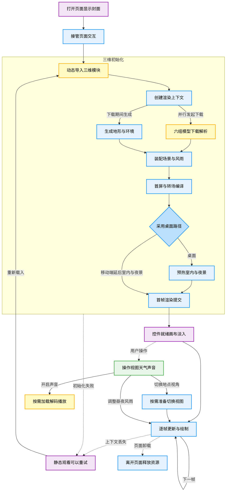

# 页面从进入到离开的整体流程

这张图描述当前代码的实际生命周期。页面只有一个入口；室内、望月、井边和林间都在同一个三维场景中切换。实线表示主流程与数据依赖，虚线表示交互、异常或退出支线。[可编辑 Mermaid 源码](./page-lifecycle.mmd)

读图时只需留意以下边界：

- **并行**：六个 GLB 请求先发起；等待网络期间，主线程生成地形、纹理与环境，最后汇合后装配。模型解析也占用主线程；移动端额外串行化贴图解码，并非全部工作在多线程同时执行。
- **按需**：模型与天气系统在启动时就已准备。移动端首次进屋才创建室内 HDR/MSAA/GTAO 管线，夜景没有提前预热；声音只在用户开启后下载、解码，雨声随天气需要加载。天气和声音面板点击后挂载。
- **声音观测路径**：静音 → 首次开启 → 关闭 → 再次开启 → 音量面板与调节；再随天气、井边和林间视图观察新增声层。系统按钮各有独立采集段，记录前后声音、昼夜、风雨、地点与暂停状态，再把帧调度停顿定位到操作区间。它覆盖声明的路径，不穷举所有状态组合。
- **就绪**：首帧提交后设置 `ready`，启用控件并开始画布淡入；RAF 循环与淡入同时进行。这里的提交不代表 GPU 已完成或屏幕已呈现，不能把它们记成同一个性能指标。
- **持续运行**：每帧更新相机、光照、植被和风雨，再绘制当前视图与转场；室内使用后处理。视图切换先保留上一帧，提交目标状态，在目标帧绘制后揭开；声音独立调度。页面隐藏时跳过三维更新和绘制，声音淡出暂停；返回后恢复。
- **退出与失败**：初始化失败或 WebGL 上下文丢失后保留静态封面和正文，允许重新载入。页面卸载也适用于加载期间：取消请求和 RAF，解除事件并释放图形与声音资源。

关键代码：[页面启动、交互与重试](../../src/components/experience.tsx#L98)、[模型加载、场景构建与帧循环](../../src/components/scene/scene.ts#L77)、[室内管线按需创建](../../src/components/scene/interior-contact.ts#L121)。

图按 `to-mmd` 的语法与语义配色规范整理，已做节点、连线、配色和两份源码一致性的静态检查；未安装 Mermaid 渲染依赖，未将静态检查当作解析或图片验收。
