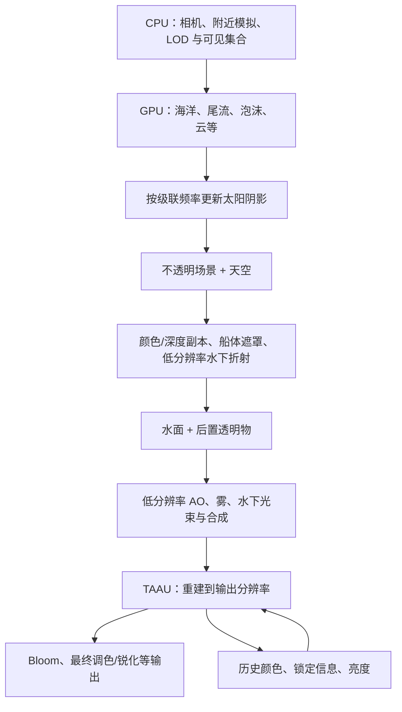

**Tidewater 3D 场景性能优化分析报告**

分析日期：2026-09-26

仓库：[dgreenheck/tidewater](https://github.com/dgreenheck/tidewater)

固定版本：[4811ba48d795197de5621985f404e765c0b7c0ef](https://github.com/dgreenheck/tidewater/commit/4811ba48d795197de5621985f404e765c0b7c0ef)，提交说明为 “Backwash: no ruled line at the draining sheet's edge”。

后续实现：已在当前竹林老屋项目的 `perf/tidewater-scene-optimizations` 分支迁移空间查询与实例更新策略，具体改动、失败试验、同条件数据及两版预览见 [迁移实施记录](../performance/optimizations/001-tidewater-transfer.md)。

本报告基于源码静态分析，核对 App 的默认调用链、JavaScript 实现、WGSL shader、资源加工脚本与性能测试代码。补充验证仅执行纯 CPU 几何生成函数，以及使用空实现设备验证缓冲分配和上传行为；没有使用 computer-use、打开游戏页面、初始化真实 WebGPU 设备或测量 FPS。

文中“实现事实”来自该提交的执行路径；“静态推导”是几何数量、像素面积或资源格式的计算；“建议”是进一步验证或改进的方向。README 中的 Apple M5 Pro、2560×1267、60 FPS 是项目目标，不能视为本次实测结果。[README](https://github.com/dgreenheck/tidewater/blob/4811ba48d795197de5621985f404e765c0b7c0ef/README.md)

**核心判断**

Tidewater 的优化主线是：**按空间距离减少几何，按屏幕贡献减少着色，按变化速度减少更新，再用历史画面重建细节。** 它同时控制 CPU 提交、GPU 顶点处理、像素与纹理带宽、模拟计算和启动编译成本。大量优化直接利用海岛场景的特点，例如远处树冠可以使用替身、远处鱼群可以暂停、环境光可以延迟更新、水面反射只需要追踪部分方向。

当前版本使用自建 WebGPU/WGSL 引擎。某些文件仍将本地引擎命名为 THREE，注释也保留 Three.js 迁移背景，但导入路径实际指向 src/engine；不能据此判断项目正在使用 Three.js 渲染器。[引擎入口](https://github.com/dgreenheck/tidewater/blob/4811ba48d795197de5621985f404e765c0b7c0ef/src/engine/Engine.js#L1)、[植被导入](https://github.com/dgreenheck/tidewater/blob/4811ba48d795197de5621985f404e765c0b7c0ef/src/world/Vegetation.js#L1)、[迁移说明](https://github.com/dgreenheck/tidewater/blob/4811ba48d795197de5621985f404e765c0b7c0ef/docs/PORTING.md)

| 成本 | 核心做法 | 主要收益 |
| --- | --- | --- |
| CPU 场景管理与提交 | 实例化、静态合批、空间索引、延迟刷新、管线与绑定缓存 | 减少对象遍历、上传与状态切换 |
| 顶点处理 | 地形/海洋 CDLOD、植被与岩石 LOD、树冠替身、草地分级 | 让细节集中在近处 |
| 像素与带宽 | 内部分辨率缩放、半分辨率效果、半精度贴图、早期拒绝无贡献计算 | 减少昂贵的像素工作 |
| GPU 模拟 | FFT 工作组内计算、合并 dispatch 所属 pass、批量 mip 生成、局部模拟和休眠 | 降低中间读写与调度成本 |
| 时间分摊 | 云的分帧采样、阴影分频、环境光分步刷新、LUT 缓存 | 压低单帧工作量与峰值 |
| 启动与资源 | 离线减面、贴图降采样、异步编译、预热 | 用加载阶段成本换取进入场景后的稳定性 |

**一、先看渲染链：它在哪些位置节省工作**

下图概括主要依赖关系，省略游戏、音频以及部分辅助 pass；不表示所有步骤具有固定耗时。



引擎让多个系统向同一个按需创建的 command encoder 记录命令，在主帧末尾提交。这样各系统保留模块边界，同时避免每个系统独立提交队列。这里是“同一命令缓冲中有多个 render/compute pass”，并不等于整帧只有一个 pass。[主循环](https://github.com/dgreenheck/tidewater/blob/4811ba48d795197de5621985f404e765c0b7c0ef/src/App.js#L598)、[GPU 提交](https://github.com/dgreenheck/tidewater/blob/4811ba48d795197de5621985f404e765c0b7c0ef/src/engine/gpu/GPU.js#L102)、[场景 pass](https://github.com/dgreenheck/tidewater/blob/4811ba48d795197de5621985f404e765c0b7c0ef/src/engine/render/SceneRenderer.js#L118)、[后处理顺序](https://github.com/dgreenheck/tidewater/blob/4811ba48d795197de5621985f404e765c0b7c0ef/src/post/PostFX.js#L647)

**二、地形和海洋：用同一小网格覆盖大范围世界**

CDLOD 将世界按四叉树划分。CPU 只选择进入视锥、且距离适合当前细节级别的节点；每个节点作为同一网格的实例提交，实例参数只有起点、尺寸和 LOD。海洋默认每块 32×32 个四边形、12 级；地形默认 40×40 个四边形、9 级，并通过高度范围收紧包围盒。[CDLOD 构造](https://github.com/dgreenheck/tidewater/blob/4811ba48d795197de5621985f404e765c0b7c0ef/src/core/CDLOD.js#L17)、[节点选择](https://github.com/dgreenheck/tidewater/blob/4811ba48d795197de5621985f404e765c0b7c0ef/src/core/CDLOD.js#L287)、[海洋配置](https://github.com/dgreenheck/tidewater/blob/4811ba48d795197de5621985f404e765c0b7c0ef/src/App.js#L176)、[地形配置](https://github.com/dgreenheck/tidewater/blob/4811ba48d795197de5621985f404e765c0b7c0ef/src/world/Terrain.js#L32)

这同时节省两类工作：

- **网格复用**：每块海洋网格是 2,048 个三角形，每块地形网格是 3,200 个三角形；世界坐标与位移在顶点 shader 中计算，不必为整个海面建立均匀细网格。
- **渐变与剔除**：顶点在 LOD 交界处逐渐向粗网格吸附，以减少裂缝和跳变；地形使用真实高度区间做视锥测试，而海洋使用预设的垂直范围。
- **近处优先绘制**：选出的节点按离相机的距离排序，让先绘制的表面为后续遮挡提供深度拒绝机会。CPU 还标记了有效节点对应的缓冲更新区间，不过当前底层属性上传分支存在落差，详见第九部分。

网格变粗后，海浪采样也同步变粗。WaterSurface 根据网格间距计算 FFT 位移贴图的 mip 等级，避免在远处稀疏网格上采样过细的波浪，产生混叠和游动感。它把“几何 LOD”和“信号带宽”配合起来，而不只是减少三角形。[网格与形变](https://github.com/dgreenheck/tidewater/blob/4811ba48d795197de5621985f404e765c0b7c0ef/src/core/CDLOD.js#L69)、[排序和区间上传](https://github.com/dgreenheck/tidewater/blob/4811ba48d795197de5621985f404e765c0b7c0ef/src/core/CDLOD.js#L210)、[波浪采样等级](https://github.com/dgreenheck/tidewater/blob/4811ba48d795197de5621985f404e765c0b7c0ef/src/ocean/WaterSurface.js#L120)

**三、植被：实例化、近远分级、替身与覆盖率补偿一起使用**

默认植被以少量类别批次绘制，源码列出的主场景批次为 11 个，空级别会进一步减少。这个数量只描述植被主 pass，不能当成整帧 draw call 总数；阴影、折射及其他场景对象需要另算。[植被构建与批次](https://github.com/dgreenheck/tidewater/blob/4811ba48d795197de5621985f404e765c0b7c0ef/src/world/Vegetation.js#L20)

| 对象 | 近处表示 | 远处表示/范围 | 验证与意义 |
| --- | --- | --- | --- |
| 棕榈树 | 1,602 三角形 | 120 m 左右切换到 208 三角形 | 纯 CPU 生成器验证，三角形数减少约 87.0% |
| 阔叶树 | 树模型本身 1,070 三角形 | 65 m 左右切换为 2 三角形替身 | 极大降低远处树冠的几何量 |
| 灌木 | 灌木模型本身 110 三角形 | 45 m 左右切换为替身，180 m 外不再保留 | 小对象更早简化和退出 |
| 草地 | 18 m 内完整草叶、每叶 3 段 | 46 m 内中级；88 m 内远级，每叶最低为单三角形 | 减少草叶数量及每叶分段 |
| 岩石 | 1,280 三角形 | 320 三角形；阈值随实例尺寸调整 | 两级几何相差 4 倍 |

表中的近景树和灌木数量是独立生成器的结果。**实际 canopy 近景批次把两种几何合并为 1,180 个三角形，每个实例通过 shader 压缩掉不属于自己的部分。** 因此不能将“树本身 1,070 三角形”直接当成每棵树的全部提交成本。静态生成结果及复现脚本见报告末尾。[植被距离](https://github.com/dgreenheck/tidewater/blob/4811ba48d795197de5621985f404e765c0b7c0ef/src/world/Vegetation.js#L83)、[合并 canopy](https://github.com/dgreenheck/tidewater/blob/4811ba48d795197de5621985f404e765c0b7c0ef/src/world/Vegetation.js#L192)、[生成器](https://github.com/dgreenheck/tidewater/blob/4811ba48d795197de5621985f404e765c0b7c0ef/src/world/vegetation/PlantGeometry.js#L861)、[草地三级](https://github.com/dgreenheck/tidewater/blob/4811ba48d795197de5621985f404e765c0b7c0ef/src/world/vegetation/GrassField.js#L8)、[岩石配置](https://github.com/dgreenheck/tidewater/blob/4811ba48d795197de5621985f404e765c0b7c0ef/src/world/Rocks.js#L13)

替身采用半球八面体视向布局：每个变体烘焙 6×6 个方向，两张图集保存覆盖率、明暗结构、法线等信息。运行时每棵植物只画一个面向相机的四边形；100 m 内混合相邻三个视向，超过该距离只取一个主要视向。140–320 m 区间还逐步剔除一半树冠，并放大剩余树冠来维持远处树林的覆盖。[替身格式与阈值](https://github.com/dgreenheck/tidewater/blob/4811ba48d795197de5621985f404e765c0b7c0ef/src/world/vegetation/Impostors.js#L10)、[稀疏与取样](https://github.com/dgreenheck/tidewater/blob/4811ba48d795197de5621985f404e765c0b7c0ef/src/world/vegetation/Impostors.js#L205)

CPU 也做了分工：植物记录进入 32 m 的均匀网格，近景集合通常在相机移动 6 m 后才重建；远景 canopy 按 6 m 距离桶排序，相机移动 16 m 才重新排序。植被管理器通常每帧最多刷新两个类别，优先处理最需要刷新的类别；超出安全余量的移动会立即刷新，避免快速移动时留下空洞。缓冲中的保守范围与 shader 中逐帧计算的距离切换配合，因此 CPU 不必每帧重建全部植物列表。[空间查询](https://github.com/dgreenheck/tidewater/blob/4811ba48d795197de5621985f404e765c0b7c0ef/src/world/vegetation/InstanceLOD.js#L24)、[刷新与排序](https://github.com/dgreenheck/tidewater/blob/4811ba48d795197de5621985f404e765c0b7c0ef/src/world/vegetation/InstanceLOD.js#L208)、[分帧调度](https://github.com/dgreenheck/tidewater/blob/4811ba48d795197de5621985f404e765c0b7c0ef/src/world/Vegetation.js#L232)

草地另用 8×8 m 单元：CPU 跳过没有草的格子，并进行距离和视锥测试；GPU 根据高度图、密度遮罩放置草叶。相机几乎没移动、没转向时，CPU 跳过可见单元重算。远处逐渐减少草叶，同时增宽剩余草叶，最终交接给地面的草地材质。这是在维持视觉覆盖率的同时减少几何。[草地单元与刷新](https://github.com/dgreenheck/tidewater/blob/4811ba48d795197de5621985f404e765c0b7c0ef/src/world/vegetation/GrassField.js#L532)

取舍也明确：替身增加启动烘焙和图集占用；近远交接时两个 LOD 会短暂共存；在顶点 shader 中“缩为零”的实例仍有顶点处理成本。实例化减少提交次数，并不能自动消除所有不可见工作。

**四、批次组织：根据对象特点选择合并、实例化或间接绘制**

村庄把静态零件按材质归并；不透明部分进一步拼入同一份 CPU 顶点/索引数据，各材质使用自己的索引区间。阴影 pass 只让一个代表 mesh 扩展到全部不透明索引范围，因此这部分村庄每个级联只需一次阴影绘制。会摆动的招牌和部分特殊表面另行处理。[村庄组装](https://github.com/dgreenheck/tidewater/blob/4811ba48d795197de5621985f404e765c0b7c0ef/src/world/Village.js#L523)

珊瑚与鱼使用 ReefBatch：不同模型和 LOD 拼入大几何，通过实例 ID 列表与 storage buffer 查找状态；CPU 做剔除和 LOD 后，写出每个非空模型类别的 indirect draw 参数。数组、计数和偏移列表被复用。过渡带的对象走单独的 dither 批次，使普通批次的 shader 保持不含过渡 discard；阴影只画指定类别或代理模型。[ReefBatch](https://github.com/dgreenheck/tidewater/blob/4811ba48d795197de5621985f404e765c0b7c0ef/src/world/reef/ReefBatch.js#L5)、[commit 实现](https://github.com/dgreenheck/tidewater/blob/4811ba48d795197de5621985f404e765c0b7c0ef/src/world/reef/ReefBatch.js#L291)、[珊瑚空间剔除](https://github.com/dgreenheck/tidewater/blob/4811ba48d795197de5621985f404e765c0b7c0ef/src/world/Reef.js#L1315)

这里有两个边界：

1. **间接绘制仍由 CPU 组织。** 当前 ReefBatch 的命令由 JavaScript 写入；MeshRenderer 对不同命令偏移逐一调用 drawIndexedIndirect。一个场景 mesh 不等于一次 draw，也不能据此认定它采用了完整的 GPU 剔除管线。[实际提交](https://github.com/dgreenheck/tidewater/blob/4811ba48d795197de5621985f404e765c0b7c0ef/src/engine/render/MeshRenderer.js#L569)
2. **CPU 共享几何不保证 GPU 共享缓冲。** 村庄创建多个 BufferGeometry，复用相同属性与索引对象；但 MeshRenderer 的顶点/索引 GPU 缓存按 geometry 对象隔离。用空实现设备验证：两个 geometry 共享同一 CPU position 和 index，仍触发四次缓冲创建，即两份顶点缓冲加两份索引缓冲。实际显存浪费量尚未测量，但分配路径已在代码级复现。这是优先值得修正的实现落差。[CPU 共享](https://github.com/dgreenheck/tidewater/blob/4811ba48d795197de5621985f404e765c0b7c0ef/src/world/Village.js#L540)、[缓存与分配](https://github.com/dgreenheck/tidewater/blob/4811ba48d795197de5621985f404e765c0b7c0ef/src/engine/render/MeshRenderer.js#L120)

**五、海洋模拟：融合计算与局部模拟，避免大规模中间读写**

OceanFFT 默认四个 256×256 频谱级联，覆盖约 733、157、33.3、7.1 m 的不同波长范围。八个实数场打包进四个复数场；行变换将时间演化与 IFFT 结合，列变换将 IFFT、符号修正、泡沫累积以及位移/导数输出结合。每组使用 128 个线程，在工作组共享内存中完成 256 点 FFT 的多个阶段，减少逐阶段访问全局缓冲。[频谱参数与打包](https://github.com/dgreenheck/tidewater/blob/4811ba48d795197de5621985f404e765c0b7c0ef/src/ocean/OceanFFT.js#L5)、[行列内核](https://github.com/dgreenheck/tidewater/blob/4811ba48d795197de5621985f404e765c0b7c0ef/src/ocean/OceanFFT.js#L383)

必须区分两个数字：

- **核心 FFT 是两次 dispatch**：一次处理所有级联的行，一次处理所有级联的列。
- **常态完整更新是六次 dispatch**：再加位移图、导数图各两次 mip 生成，六次都录入同一个 compute pass。重新生成初始频谱时还会增加初始化 dispatch。

mip 生成利用共享内存，在第一阶段生成 1–5 级、第二阶段生成剩余级别；与“两张图 × 四层 × 八个 mip，各自一个 render pass”的朴素组织相比，避免了 64 个细碎 render pass。这个数字描述调度结构差异，不是经过本次测量的 64 倍加速。[mip 内核](https://github.com/dgreenheck/tidewater/blob/4811ba48d795197de5621985f404e765c0b7c0ef/src/ocean/OceanFFT.js#L529)、[完整 update](https://github.com/dgreenheck/tidewater/blob/4811ba48d795197de5621985f404e765c0b7c0ef/src/ocean/OceanFFT.js#L605)、[通用 ComputeMips](https://github.com/dgreenheck/tidewater/blob/4811ba48d795197de5621985f404e765c0b7c0ef/src/ocean/ComputeMips.js#L3)

船尾流使用 512×512、单元 0.4 m 的局部窗口。窗口按世界单元取模，跟随船移动时不必整体搬运状态；正逆 FFT 与物理更新合在三个 dispatch 中。船停止产生有效运动约 40 秒后，系统休眠，停止模拟 dispatch。海滩的泡沫、湿沙和残留泡沫则在固定 380 m、768×768 区域更新，避免把近岸细节模拟扩展到整片海洋。[尾流窗口](https://github.com/dgreenheck/tidewater/blob/4811ba48d795197de5621985f404e765c0b7c0ef/src/ocean/WakeSim.js#L5)、[休眠与移动](https://github.com/dgreenheck/tidewater/blob/4811ba48d795197de5621985f404e765c0b7c0ef/src/ocean/WakeSim.js#L847)、[海滩局部状态](https://github.com/dgreenheck/tidewater/blob/4811ba48d795197de5621985f404e765c0b7c0ef/src/ocean/ShoreSim.js#L5)

喷雾采用固定容量 GPU storage 环形缓冲，由 GPU 发射器和 CPU 的少量发射请求共同写入，粒子积分在 compute shader 中完成。它节省了逐粒子 CPU 更新，但仍按总容量 dispatch、以固定实例槽绘制，死亡粒子在 shader 中被隐藏，并不是压缩后的“只绘制活粒子”列表。[粒子容量](https://github.com/dgreenheck/tidewater/blob/4811ba48d795197de5621985f404e765c0b7c0ef/src/fx/Spray.js#L109)、[更新和实例绘制](https://github.com/dgreenheck/tidewater/blob/4811ba48d795197de5621985f404e765c0b7c0ef/src/fx/Spray.js#L476)

**六、体积云：最显著的空间降采样与跨帧复用**

默认 App 使用 SkyProClouds；只有 oldClouds 参数才切换到旧 Clouds。必须沿着默认路径分析，旧版测试或注释里的参数不能直接套用。[默认选择](https://github.com/dgreenheck/tidewater/blob/4811ba48d795197de5621985f404e765c0b7c0ef/src/App.js#L115)

默认配置为 historyDivisor=2、lattice=4。设输出为 W×H、内部比例为 s：

- 真正昂贵的光线步进约在 sW/8 × sH/8 上执行，即输出像素的 **s²/64**。
- 历史重建约为 sW/2 × sH/2，即输出像素的 **s²/4**。
- 4×4 格点在 16 帧内轮换，再用相机与风场信息重投影。

所以在 s=1 时，主视图每帧新追踪射线数量约为全分辨率逐像素追踪的 1/64；它仍要支付半分辨率时域重建、全景与阴影等成本，不能将总云耗时直接除以 64。[质量参数](https://github.com/dgreenheck/tidewater/blob/4811ba48d795197de5621985f404e765c0b7c0ef/src/sky/SkyProClouds.js#L50)、[实际尺寸计算](https://github.com/dgreenheck/tidewater/blob/4811ba48d795197de5621985f404e765c0b7c0ef/src/sky/SkyProClouds.js#L855)、[采样循环](https://github.com/dgreenheck/tidewater/blob/4811ba48d795197de5621985f404e765c0b7c0ef/src/sky/SkyProClouds.js#L946)

单条射线也有多层减负：利用天气区域上界跳过空单元，在空区域加大步长，进入云后细化；远处使用更粗噪声 mip；透射率低于 0.003 时结束；邻近步长复用光照追踪结果，只有距离、密度或光照精度状态改变到一定程度才重新计算。[步进与光照复用](https://github.com/dgreenheck/tidewater/blob/4811ba48d795197de5621985f404e765c0b7c0ef/src/sky/SkyProClouds.js#L234)

其他更新按低频处理：512×160 全景常态每帧更新 1/16，256×256 云影每帧更新 1/4 行；相机完全进入水下后，跳过主视图云的追踪和时域重建，继续保留水面反射与水下视窗需要的全景。大幅相机变化、光源变化等条件会失效历史。[更新与水下分支](https://github.com/dgreenheck/tidewater/blob/4811ba48d795197de5621985f404e765c0b7c0ef/src/sky/SkyProClouds.js#L1000)

代价是变化响应依赖历史，快速转向和历史失效会增加重建压力。源码有失效处理，但本次没有视觉实测，不能据此保证没有拖影或瞬时细节缺失。

**七、分辨率与后处理：把昂贵工作放在较小图像上**

App 的内部 render scale 范围为 0.5–1，步长 0.05，场景先在内部尺寸渲染，再经 TAAU 输出。canvas 默认使用 CSS 窗口尺寸乘引擎比例，没有直接乘系统 devicePixelRatio；这也限制了高 DPI 屏幕上的默认像素成本。[尺寸分配](https://github.com/dgreenheck/tidewater/blob/4811ba48d795197de5621985f404e765c0b7c0ef/src/engine/Engine.js#L58)、[内部尺寸](https://github.com/dgreenheck/tidewater/blob/4811ba48d795197de5621985f404e765c0b7c0ef/src/post/PostFX.js#L558)

| 内部宽高比例 s | 主场景像素占输出比例 | 仅像素数量的减少 |
| --- | --- | --- |
| 1.00 | 100% | 0% |
| 0.75 | 56.25% | 43.75% |
| 0.50 | 25% | 75% |

**当前实现不是按帧率自动调节分辨率。** App 明确写明手工设置，因为改变比例会重建场景、后处理和云的 render target；实际入口是 URL scale 参数和 UI 滑杆。README 对 dynamic resolution 的表述应以这里的代码行为为准。[App.setRenderScale](https://github.com/dgreenheck/tidewater/blob/4811ba48d795197de5621985f404e765c0b7c0ef/src/App.js#L704)、[UI 入口](https://github.com/dgreenheck/tidewater/blob/4811ba48d795197de5621985f404e765c0b7c0ef/src/ui/AppUI.js#L230)

各效果还进一步分级：

| 效果 | 实际实现 | 为什么有效 |
| --- | --- | --- |
| GTAO | 内部半宽高；R16F 深度副本；samples 参数 12；两次 5 tap 深度感知模糊 | 减少远距离散乱深度采样的带宽和像素量 |
| 被水覆盖的 AO | 深度预处理中标记，AO 跳过相应工作 | 不为最后不可见的 AO 支付完整成本 |
| 空气光束 | 内部半宽高、16 步；部分屏幕空间光线为四分之一宽高 | 利用低频特征和时域积累恢复平滑结果 |
| 水下光束 | 半分辨率；镜头可能入水时才执行 | 避免陆地视角承担水下体积积分 |
| 水下折射源 | 内部 0.5 比例，同时扩大 guard band | 以较低像素密度重绘必要的水下对象 |
| Bloom | 从输出半宽高开始，逐级降到 1/32 | 大范围模糊在较小纹理完成 |

[AO 配置和遮挡标记](https://github.com/dgreenheck/tidewater/blob/4811ba48d795197de5621985f404e765c0b7c0ef/src/post/PostFX.js#L104)、[空气光束](https://github.com/dgreenheck/tidewater/blob/4811ba48d795197de5621985f404e765c0b7c0ef/src/post/AirHaze.js#L13)、[水下执行条件](https://github.com/dgreenheck/tidewater/blob/4811ba48d795197de5621985f404e765c0b7c0ef/src/post/PostFX.js#L657)、[折射尺寸](https://github.com/dgreenheck/tidewater/blob/4811ba48d795197de5621985f404e765c0b7c0ef/src/ocean/RefractionPass.js#L143)、[Bloom](https://github.com/dgreenheck/tidewater/blob/4811ba48d795197de5621985f404e765c0b7c0ef/src/post/PostFX.js#L326)

两个容易误读的细节：

- 折射图有横向 1.15、纵向 1.3 的 guard band，面积约为内部主场景的 0.5²×1.15×1.3=**37.375%**，不是恰好 25%。扩大视野是为折射后落在屏幕外的海床保留采样来源。
- SceneRenderer.opaqueDepthHalf 中的 Half 指 **16 位浮点精度**；该图与主场景同宽高。AO 使用的 aoDepth 才同时降低宽高。混淆两者会错误估算带宽和资源占用。[深度副本的创建与尺寸](https://github.com/dgreenheck/tidewater/blob/4811ba48d795197de5621985f404e765c0b7c0ef/src/engine/render/SceneRenderer.js#L47)

TAAU 借用了 FSR2 的累积、细线锁定、亮度不稳定检测和邻域约束思想，把主要累积合入一个 pass；它是自定义改写，不是完整集成官方 FSR2。水面没有完整描述自身波动的运动矢量，因此还有水面专门处理。该机制让低分辨率、随机采样和细小几何更可用，但带来历史采样、重投影与显存成本。[TAAU 设计与边界](https://github.com/dgreenheck/tidewater/blob/4811ba48d795197de5621985f404e765c0b7c0ef/src/post/TemporalUpscale.js#L12)

以项目目标 2560×1267 计算，两套 TAAU 历史目标各有 RGBA16F 颜色、RGBA16F 锁定和 RGBA8 亮度，总有效纹理载荷约 **123.7 MiB**，尚不含前帧深度、场景目标、云和其他资源，也未计驱动对齐。历史图保持输出分辨率，不能认为降低内部 scale 就会同比降低全部显存或整帧时间。[历史目标格式](https://github.com/dgreenheck/tidewater/blob/4811ba48d795197de5621985f404e765c0b7c0ef/src/post/TemporalUpscale.js#L121)

**八、光照与材质：只在必要位置保留昂贵计算**

太阳阴影使用三层 2048² 级联，分界约为 10、60、400 m。太阳方向稳定时，各层每 1、2、4 帧更新一次；平均为 1.75 个级联更新/帧，相比每帧重绘三层，更新次数减少约 41.7%。太阳变化或 dirty 状态会强制更新，因此该推导有条件，也不等价于阴影 GPU 时间减少 41.7%。投影范围还进行 texel 对齐，使跨帧复用时更稳定。[级联设置](https://github.com/dgreenheck/tidewater/blob/4811ba48d795197de5621985f404e765c0b7c0ef/src/engine/render/Shadows.js#L24)、[更新条件](https://github.com/dgreenheck/tidewater/blob/4811ba48d795197de5621985f404e765c0b7c0ef/src/engine/render/Shadows.js#L126)

近层采用较贵的接触软化阴影：一次中心 blocker 采样、8 个搜索 tap，必要时再做 12 个过滤 tap；远层实际 WGSL 使用 5 tap PCF。水面可直接走廉价 PCF；折射源使用更便宜的单次硬阴影采样。Shadows.js 顶部残留的“16-tap PCF”注释与实际 shader 不一致，本报告采用执行代码中的数值。[实际阴影 shader](https://github.com/dgreenheck/tidewater/blob/4811ba48d795197de5621985f404e765c0b7c0ef/src/engine/render/wgsl/lighting.js#L130)、[折射光照分支](https://github.com/dgreenheck/tidewater/blob/4811ba48d795197de5621985f404e765c0b7c0ef/src/engine/render/wgsl/lighting.js#L395)

以下缓存和分摊减少重复积分：

| 数据 | 更新策略 |
| --- | --- |
| 大气透射率/多次散射 LUT | 静态参数变化后更新 |
| 天空视图 LUT | 参数变化后更新；海面附近相机高度按 2 m 量化，高处约 2% 量化 |
| CPU 使用的天空辐照度 | 约每 0.25 秒积分并异步回读 |
| 环境光照 cubemap | 默认约 3 秒或太阳变化触发；每帧处理一个阶段，完成后交换前后缓冲 |
| 地形长距离太阳阴影 | 512² 预计算，太阳角度变化超过约 0.0015 rad 才重算 |
| 地面一次反弹光 | 随地形太阳阴影重烘焙，用近似贴图查询代替逐像素复杂间接照明 |

环境光还将漫反射压缩为 9 个球谐系数；镜面反射使用预过滤 cubemap 的不同粗糙度级别。这些都是用可复用的表示替代昂贵积分。[大气更新](https://github.com/dgreenheck/tidewater/blob/4811ba48d795197de5621985f404e765c0b7c0ef/src/sky/Atmosphere.js#L471)、[环境光配置](https://github.com/dgreenheck/tidewater/blob/4811ba48d795197de5621985f404e765c0b7c0ef/src/sky/Environment.js#L52)、[分步刷新](https://github.com/dgreenheck/tidewater/blob/4811ba48d795197de5621985f404e765c0b7c0ef/src/sky/Environment.js#L253)、[地形阴影](https://github.com/dgreenheck/tidewater/blob/4811ba48d795197de5621985f404e765c0b7c0ef/src/world/TerrainGPU.js#L186)、[地面反弹](https://github.com/dgreenheck/tidewater/blob/4811ba48d795197de5621985f404e765c0b7c0ef/src/materials/GroundBounce.js#L9)

材质内部同样按最终贡献裁减：

- 局部灯光只选取相机附近的最多 8 盏，手电启用时占用其中一个位置；通过统一循环计算，白天无有效光源时循环为空。植被、地面等表面使用 Lambert 简化路径，重要硬表面保留完整高光。
- 深海床走较便宜的材质分支；折射源中进一步扩大该分支适用范围。
- 水面 SSR 只在反射方向、Fresnel 权重和视向条件合适时执行；最多 11 次递增步长搜索，再做 3 次二分细化，越界或无贡献时提前停止。
- 船体遮罩使用有/无 hull-discard 两种水面管线，只在必要时使用包含 discard 的版本；折射裁剪在设备支持时使用 clip-distances，避免先光栅化再丢弃。

这些优化降低“最终几乎不可见、却很贵”的工作。包含 discard 对硬件早期深度/隐藏面剔除的影响与设备有关，不应把源码注释中的表述理解为所有 GPU 都有完全相同的行为。[灯光预算](https://github.com/dgreenheck/tidewater/blob/4811ba48d795197de5621985f404e765c0b7c0ef/src/materials/LocalLights.js#L8)、[场景材质选择](https://github.com/dgreenheck/tidewater/blob/4811ba48d795197de5621985f404e765c0b7c0ef/src/App.js#L234)、[海床分支](https://github.com/dgreenheck/tidewater/blob/4811ba48d795197de5621985f404e765c0b7c0ef/src/world/Terrain.js#L189)、[SSR 条件](https://github.com/dgreenheck/tidewater/blob/4811ba48d795197de5621985f404e765c0b7c0ef/src/ocean/WaterMaterial.js#L345)、[SSR 步进](https://github.com/dgreenheck/tidewater/blob/4811ba48d795197de5621985f404e765c0b7c0ef/src/ocean/WaterMaterial.js#L680)、[水面变体](https://github.com/dgreenheck/tidewater/blob/4811ba48d795197de5621985f404e765c0b7c0ef/src/ocean/WaterMaterial.js#L125)、[硬件裁剪](https://github.com/dgreenheck/tidewater/blob/4811ba48d795197de5621985f404e765c0b7c0ef/src/engine/render/MeshShader.js#L11)

**九、CPU、GPU 通信与启动：避免同步等待和重复准备**

渲染器缓存管线、顶点布局、绑定布局和 shader module；BindingSet 保留少量不同资源组合，方便前后缓冲交换时复用 bind group。单次绘制列表通过 token 避免重复处理绑定；绘制时也跳过没有变化的 pipeline/bind group 设置。每个对象在当帧共用一个 per-draw uniform 槽，提交前批量上传；普通属性按版本缓存，数据不变时跳过上传。[每帧 uniform](https://github.com/dgreenheck/tidewater/blob/4811ba48d795197de5621985f404e765c0b7c0ef/src/engine/render/MeshRenderer.js#L58)、[属性上传](https://github.com/dgreenheck/tidewater/blob/4811ba48d795197de5621985f404e765c0b7c0ef/src/engine/render/MeshRenderer.js#L143)、[布局缓存](https://github.com/dgreenheck/tidewater/blob/4811ba48d795197de5621985f404e765c0b7c0ef/src/engine/render/MeshRenderer.js#L215)、[绑定缓存](https://github.com/dgreenheck/tidewater/blob/4811ba48d795197de5621985f404e765c0b7c0ef/src/engine/gpu/Shader.js#L302)

**局部属性上传目前没有按设计生效。** CDLOD 和多种实例批次会填写 updateRanges；但底层条件是 conv.array === src.array，而 convertArray 返回的是 TypedArray 本身，普通数组没有这里期待的 array 属性，因此走向全量 writePadded。空实现设备复现结果为：一个 36 字节的 position 数组，声明仅更新 12 字节，实际 writeBuffer 仍写入全部 36 字节。版本缓存仍然有效，但不能将该路径描述成已经实现了局部上传。这一结论是代码行为验证，不是 GPU 带宽实测。[区间分支](https://github.com/dgreenheck/tidewater/blob/4811ba48d795197de5621985f404e765c0b7c0ef/src/engine/render/MeshRenderer.js#L163)、[转换函数返回值](https://github.com/dgreenheck/tidewater/blob/4811ba48d795197de5621985f404e765c0b7c0ef/src/engine/render/MeshRenderer.js#L641)

GPU 到 CPU 的回读采用 staging buffer 环形队列，通过 mapAsync 接收结果，槽位忙时放弃发起新的回读。水面查询最多 64 点，GPU 上的镜头水线使用当前帧结果，CPU 物理接受异步延迟；WaterQuery 自身还用 pending 标记限制未完成回读。因此它不是每帧等待 GPU 再继续跑物理。[Readback](https://github.com/dgreenheck/tidewater/blob/4811ba48d795197de5621985f404e765c0b7c0ef/src/engine/gpu/Readback.js#L3)、[水面查询](https://github.com/dgreenheck/tidewater/blob/4811ba48d795197de5621985f404e765c0b7c0ef/src/ocean/WaterQuery.js#L4)、[pending 处理](https://github.com/dgreenheck/tidewater/blob/4811ba48d795197de5621985f404e765c0b7c0ef/src/ocean/WaterQuery.js#L192)

远处鱼群暂停 CPU 模拟，近处才激活；渲染还按群体做距离/视锥测试，再按鱼的屏幕尺寸选择 LOD。模拟范围与绘制范围分开，使对象在出画面后仍可短暂维持连续行为，而更远处不承担完整更新。[鱼群阈值](https://github.com/dgreenheck/tidewater/blob/4811ba48d795197de5621985f404e765c0b7c0ef/src/world/Fish.js#L33)、[激活逻辑](https://github.com/dgreenheck/tidewater/blob/4811ba48d795197de5621985f404e765c0b7c0ef/src/world/Fish.js#L655)、[屏幕尺寸与剔除](https://github.com/dgreenheck/tidewater/blob/4811ba48d795197de5621985f404e765c0b7c0ef/src/world/Fish.js#L1430)

启动期间采用异步 pipeline 创建，precompile 遍历隐藏和视野外对象的 pass 变体，并强制准备两种水面船体变体；之后再预热两帧。这样可将许多首次遇到材质时的卡顿前移到加载阶段。它没有消除编译总成本，部分即时需要的 compute/post 管线还保留同步创建兜底。[异步管线](https://github.com/dgreenheck/tidewater/blob/4811ba48d795197de5621985f404e765c0b7c0ef/src/engine/gpu/GPU.js#L136)、[预编译与预热](https://github.com/dgreenheck/tidewater/blob/4811ba48d795197de5621985f404e765c0b7c0ef/src/App.js#L372)

资源侧也有离线约束：摊位道具按三角形预算减面，通常约 1,500–4,500 三角形；道具纹理降到 512 px、表面纹理为 1K；角色贴图从 2K 缩到 1K。当前 GLB 加载器明确不处理 Draco/meshopt，不能将其归功于运行时网格压缩解码。[减面脚本](https://github.com/dgreenheck/tidewater/blob/4811ba48d795197de5621985f404e765c0b7c0ef/tools/props/decimate.py#L1)、[道具纹理](https://github.com/dgreenheck/tidewater/blob/4811ba48d795197de5621985f404e765c0b7c0ef/tools/props/build.mjs#L22)、[角色加工](https://github.com/dgreenheck/tidewater/blob/4811ba48d795197de5621985f404e765c0b7c0ef/tools/characters/README.md)、[GLB 支持范围](https://github.com/dgreenheck/tidewater/blob/4811ba48d795197de5621985f404e765c0b7c0ef/src/engine/loaders/GLTF.js#L7)

补充静态盘点：该提交 public/ 共 136 个受 Git 跟踪的文件，总计 54,287,754 字节，约 51.8 MiB，包含音频、说明和可选模型。最大单文件为鲸鱼高度 PNG，约 12.3 MiB。**这是仓库文件体积，不是首屏下载量、压缩后的 HTTP 传输量或运行时显存。** 盘点方法和原始数字保存在静态证据 JSON 中。

**十、如何判断效果，以及哪些结论仍不能下**

仓库包含可复现的性能分析设施：BenchSeed 固定随机数；Bench 以固定视角与尺寸运行，默认先预热 90 帧，再测量 120 帧，并用 GPU timestamp 收集各 render/compute pass。它还考虑到某些 GPU 上 pass 时间区间重叠，以结束时间分摊贡献，避免直接把重叠区间相加。[固定随机种子](https://github.com/dgreenheck/tidewater/blob/4811ba48d795197de5621985f404e765c0b7c0ef/src/core/BenchSeed.js#L1)、[计时组织](https://github.com/dgreenheck/tidewater/blob/4811ba48d795197de5621985f404e765c0b7c0ef/src/core/Bench.js#L8)、[测量循环](https://github.com/dgreenheck/tidewater/blob/4811ba48d795197de5621985f404e765c0b7c0ef/src/core/Bench.js#L233)

但应注意已有工具的覆盖：

- App 默认只向 Profiler 注册 FFT 行、FFT 列和 sky view 三个条目；FFT 行列实际运行在外部共享 compute pass 中，ComputeKernel 在这种路径下不会应用自己的 timestampWrites。因此不能把这个 HUD 的 compute/render 值当成完整整帧 GPU 成本。完整 pass 观察更适合使用 Bench 的 encoder 包装路径。
- test/sky-perf.mjs 使用旧 Clouds，而 App 默认是 SkyProClouds。若要测默认画质，应先校正测试场景。
- Bench.auto 多轮时取每个视角最快结果，适合一定条件下做改动比较，但不能替代面向用户体验的 P95/P99、持续运行和温度变化统计。
- 本次没有执行这些 GPU benchmark，也没有形成“优化前/后快了多少毫秒”的结论。

[Profiler 接入](https://github.com/dgreenheck/tidewater/blob/4811ba48d795197de5621985f404e765c0b7c0ef/src/App.js#L363)、[ComputeKernel 分支](https://github.com/dgreenheck/tidewater/blob/4811ba48d795197de5621985f404e765c0b7c0ef/src/engine/gpu/Compute.js#L48)、[旧云测试](https://github.com/dgreenheck/tidewater/blob/4811ba48d795197de5621985f404e765c0b7c0ef/test/sky-perf.mjs#L1)、[最快轮次选择](https://github.com/dgreenheck/tidewater/blob/4811ba48d795197de5621985f404e765c0b7c0ef/src/core/Bench.js#L208)

**十一、后续优化的优先顺序**

下面是依据代码提出的工作顺序；优先级体现证据和实施范围，不代表已证明的耗时排名。

| 优先级 | 方向 | 依据与验收方式 |
| --- | --- | --- |
| 1 | 修正共享几何的 GPU 缓冲复用 | CPU mock 已复现重复分配；将缓存下沉到共享属性/索引资源时，同步明确释放所有权。比较缓冲数量、字节数、上传量，并验证各材质 drawRange 与阴影范围 |
| 1 | 修正普通属性的局部上传分支 | CPU mock 已复现请求 12 字节却上传 36 字节；核对 TypedArray 返回值与 range 条件，并验证未转换属性、转换属性、首次上传和容量变化路径 |
| 1 | 统一默认场景与性能计时口径 | 默认云、旧云测试与简易 Profiler 覆盖不一致。先记录完整 pass、冷启动、稳定态与 P95/P99，再评价其他改动 |
| 2 | 评估自动分辨率与质量档位 | 现有 scale 只能手动控制；自动控制需滞回、更新间隔与目标重建策略，避免反复分配。FFT、尾流和阴影等固定开销还需独立档位 |
| 2 | 减少合批后的无效顶点工作 | 近景 canopy、扫描碎屑通过压缩其他模型顶点来换取少量 draw。比较按模型/空间分批与现状的 CPU 提交、顶点数和 GPU 时间 |
| 2 | 缩短冷启动关键路径 | 预编译和替身烘焙集中在启动；评估预生成图集、分阶段预热与真正首屏必需变体，统计首个可交互帧和之后的首次使用卡顿 |
| 3 | 建立显存与贴图预算 | TAAU 历史已约 123.7 MiB 有效载荷，另有云、折射、阴影和资源纹理。先测资源生命周期，再决定格式、分辨率或压缩方案 |

最有迁移价值的设计不是某个单独的图形算法，而是这些算法之间的配合：LOD 配合纹理带宽限制，实例化配合空间索引，低分辨率效果配合时域重建，缓存配合明确的失效条件，异步回读配合允许延迟的使用方。复制单项技术时，需要一并保留这些条件。

**附：本次代码级证据与复现**

- [静态证据 JSON](../../outputs/research/tidewater-4811ba4/static-evidence.json)：固定提交、生成器结果、mock 缓冲分配与上传结果、像素/显存推导、资源盘点及限制。
- [纯 CPU 分析脚本](../../outputs/research/tidewater-4811ba4/analyze.mjs)：接受 tidewater checkout 路径，会核对提交；不创建真实 GPU 设备。
- 本次源码副本位于 /tmp/tidewater-analysis.VYkXfK。报告中的线上源码链接全部固定到相同提交，不依赖该临时目录。
- 报告正文保存在 docs/research/tidewater-performance-analysis.md；outputs/ 下的证据文件按当前工作区规则被 Git 忽略，分享报告时请同时复制证据文件，或按脚本重新生成。

在已有该提交 checkout 的环境中，复现命令如下；--inventory 会读取全部 public/ Git blob 的大小，部分克隆可能因此补取缺失 blob。

```sh
node outputs/research/tidewater-4811ba4/analyze.mjs /absolute/path/to/tidewater --inventory > outputs/research/tidewater-4811ba4/static-evidence.json
```

以上三角形数量、像素比例、缓冲分配/上传行为和文件字节数属于代码级验证。实际 FPS、GPU 毫秒数、首访时间、画质和设备适配范围，需要另行进行运行时测量。
